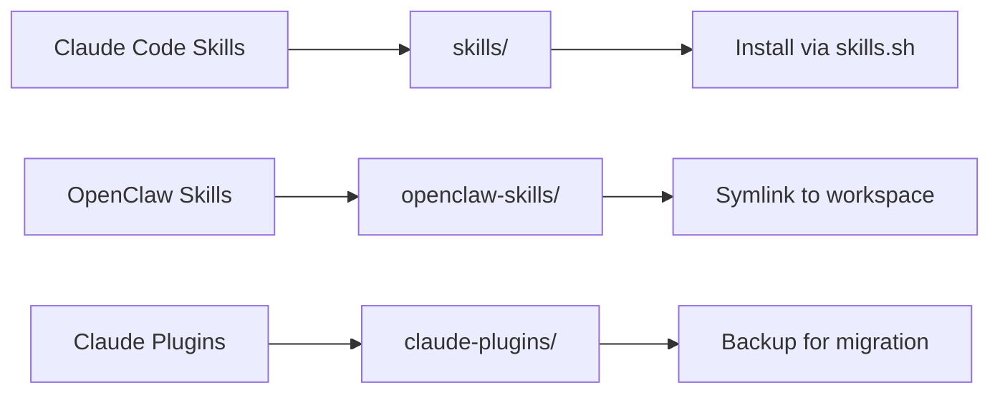

# 🚀 Awesome Skills

> A curated collection of powerful skills and plugins for Claude Code and OpenClaw

**Multi-Agent Workflows** · **LaTeX Processing** · **Notion Integration** · **Code Quality** · **Remote Execution**

[](https://skills.sh)
[](https://opensource.org/licenses/MIT)
[](https://claude.ai/code)
[](https://openclaw.com)

---

## ✨ Features

- **Multi-Agent Review** — Parallel AI reviewers (Gemini, Codex, Claude) for code and papers
- **LaTeX Workflows** — Automated paper review and polishing with git worktree isolation
- **Notion Automation** — Create, organize, and update Notion pages programmatically
- **Code Quality** — Technical debt scanning and conventional commit generation
- **Remote Dispatch** — Fire-and-forget tasks to remote HPC environments
- **Skills Manifest** — Environment migration tracking for all installed skills

## 📦 Available Skills

Skills for [Claude Code](https://claude.ai/code) that extend capabilities with specialized workflows:

| Skill | Description |
|-------|-------------|
| [diff-review](./skills/diff-review/) | Multi-agent code review using Gemini, Codex, and Claude in parallel. Auto-detects expertise and merges findings |
| [notion-organizer](./skills/notion-organizer/) | Automatically organize and optimize Notion page content given a Notion URL |
| [paper-polish](./skills/paper-polish/) | Multi-agent LaTeX paper polishing: Gemini (accuracy), Codex (de-LLM), Claude (flow) in parallel worktrees with merge |
| [paper-review](./skills/paper-review/) | Multi-agent LaTeX paper review using Gemini, Codex, and Claude. Reviews writing, logic, structure, formatting |
| [techdebt](./skills/techdebt/) | Scan codebase for technical debt: duplicated code, code smells, architectural issues, and maintenance risks |
| [upload-skills](./skills/upload-skills/) | Upload a local skill from ~/.claude/skills/ to the awesome-skills GitHub repo with auto-generated README |

## 🔌 Claude Plugins

Installed plugins from [claude-plugins-official](https://github.com/anthropics/claude-plugins) and community sources:

| Plugin | Version | Source | Description |
|--------|---------|--------|-------------|
| context7 | 205b6e0b3036 | claude-plugins-official | Context management for large codebases |
| feature-dev | 205b6e0b3036 | claude-plugins-official | Feature development workflow |
| ralph-loop | 205b6e0b3036 | claude-plugins-official | Iterative development loop |
| superpowers | v4.3.1 | claude-plugins-official | Extended Claude capabilities |
| commit-commands | 205b6e0b3036 | claude-plugins-official | Git commit helpers |
| claude-md-management | v1.0.0 | claude-plugins-official | CLAUDE.md file management |
| code-review | 205b6e0b3036 | claude-plugins-official | Code review workflow |
| claude-mem | v10.4.0 | thedotmack | Persistent memory management for Claude |

Plugin backup files are stored in [claude-plugins/](./claude-plugins/).

## 🌐 OpenClaw Workspace Skills

Skills for the [OpenClaw](https://openclaw.com) agent platform with extended capabilities:

| Skill | Description |
|-------|-------------|
| [notion-writer](./openclaw-skills/notion-writer/) | Create, read, update, and query Notion pages with rich content blocks. Supports database queries and page updates |
| [readme-generator](./openclaw-skills/readme-generator/) | Generate or update bilingual README.md (English + 简体中文) with auto-inferred badges and smart merge |
| [unity-claude](./openclaw-skills/unity-claude/) | Dispatch Claude Code tasks to Unity HPC via SSH with Ralph Loop, git worktree isolation, and auto-notify on completion |

## 📋 Skills Manifest

The [skills-manifest.json](./skills-manifest.json) file tracks ALL installed skills (including third-party marketplace skills) for environment migration. It captures:

- Skill name and source
- Installation method (symlink, copy, or marketplace install)
- Install command for reproducing the environment

This enables one-command environment replication:

```bash
# Read manifest and reinstall all skills
jq -r '.skills[].install' skills-manifest.json | while read cmd; do eval "$cmd"; done
```

*Last manifest update: 2026-03-08*

## 🚀 Installation

### Install Claude Code Skills

Use the skills.sh CLI to install any skill:

```bash
# Install diff-review (multi-agent code review)
npx skills add https://github.com/mitchellx/awesome-skills --skill diff-review

# Install paper-review (multi-agent LaTeX paper review)
npx skills add https://github.com/mitchellx/awesome-skills --skill paper-review

# Install paper-polish (multi-agent paper polishing)
npx skills add https://github.com/mitchellx/awesome-skills --skill paper-polish

# Install techdebt auditor
npx skills add https://github.com/mitchellx/awesome-skills --skill techdebt

# Install notion-organizer
npx skills add https://github.com/mitchellx/awesome-skills --skill notion-organizer

# Install upload-skills helper
npx skills add https://github.com/mitchellx/awesome-skills --skill upload-skills
```

Or manually copy the skill folder to your Claude Code skills directory (`~/.claude/skills/`).

### Install OpenClaw Skills

For OpenClaw workspace skills:

```bash
# Clone this repo to your OpenClaw workspace
git clone https://github.com/mitchellx/awesome-skills ~/awesome-skills

# Link OpenClaw skills to workspace
ln -s ~/awesome-skills/openclaw-skills/* ~/.openclaw/workspace/skills/
```

## 🏗️ Repository Structure

```
awesome-skills/
├── README.md                           # This file
├── LICENSE                             # MIT License
├── skills-manifest.json                # ALL installed skills tracker
├── skills/                             # Claude Code skills
│   ├── diff-review/
│   │   ├── SKILL.md
│   │   ├── README.md
│   │   ├── reviewers/                  # Role prompts for each AI
│   │   ├── expertise/                  # Domain-specific review prompts
│   │   └── templates/
│   ├── notion-organizer/
│   │   ├── SKILL.md
│   │   ├── README.md
│   │   └── scripts/notion_api.py
│   ├── paper-polish/
│   │   ├── SKILL.md
│   │   ├── README.md
│   │   └── prompts/
│   ├── paper-review/
│   │   ├── SKILL.md
│   │   ├── README.md
│   │   ├── reviewers/
│   │   └── templates/
│   ├── techdebt/
│   │   └── SKILL.md
│   └── upload-skills/
│       └── SKILL.md
├── openclaw-skills/                    # OpenClaw platform skills
│   ├── notion-writer/
│   │   ├── SKILL.md
│   │   ├── README.md
│   │   └── scripts/notion_api.py
│   ├── readme-generator/
│   │   ├── SKILL.md
│   │   └── references/
│   │       ├── readme-format.md
│   │       └── badge-rules.md
│   └── unity-claude/
│       ├── SKILL.md
│       ├── README.md
│       └── references/
│           ├── architecture.md
│           ├── git-worktree.md
│           └── superpower.md
└── claude-plugins/                     # Plugin backups
    ├── installed_plugins.json
    └── known_marketplaces.json
```

## 🔄 How It Works

The repository contains three types of extensions:



**Claude Code Skills** (`skills/`) are installed via the skills.sh CLI and run in Claude Code sessions.

**OpenClaw Skills** (`openclaw-skills/`) are designed for the OpenClaw platform with extended capabilities like SSH dispatch, sessions_spawn, and Discord notifications.

**Claude Plugins** (`claude-plugins/`) are backed up for environment restoration.

## 🛠️ Creating New Skills

To add a new skill to this collection:

1. **Create skill directory**:
   ```bash
   mkdir -p skills/my-skill
   cd skills/my-skill
   ```

2. **Write SKILL.md** with YAML frontmatter:
   ```markdown
   ---
   name: my-skill
   description: Brief description of what the skill does
   ---
   
   # My Skill
   
   Detailed documentation here...
   ```

3. **Add README.md** for documentation:
   - Installation instructions
   - Usage examples
   - Configuration options

4. **Include supporting files**:
   - Prompts, templates, scripts
   - Reference documentation
   - Test cases

5. **Test the skill**:
   ```bash
   npx skills add . --skill my-skill
   claude code /my-skill
   ```

See [skill-creator](https://skills.sh/docs/creating-skills) for detailed guidance.

## 🤝 Contributing

Contributions are welcome! Here's how you can help:

- **Report bugs** — Open an issue with reproduction steps
- **Add skills** — Submit PRs with new skills following the structure above
- **Improve docs** — Fix typos, add examples, clarify instructions
- **Share feedback** — Tell us what works and what doesn't

Please ensure your PR:
- Includes a `SKILL.md` with YAML frontmatter
- Has a descriptive README.md
- Follows the existing directory structure
- Works with the latest Claude Code version

## 📄 License

This project is licensed under the MIT License - see the [LICENSE](LICENSE) file for details.

---

**Built with ❤️ for the Claude Code community**

*Questions? Open an issue or reach out via GitHub Discussions.*
