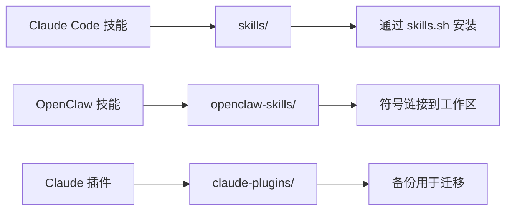

# 🚀 Awesome Skills

> Claude Code 和 OpenClaw 的精选技能与插件集合

**多智能体工作流** · **LaTeX 处理** · **Notion 集成** · **代码质量** · **远程执行**

[](https://skills.sh)
[](https://opensource.org/licenses/MIT)
[](https://claude.ai/code)
[](https://openclaw.com)

[English](README.md) | [简体中文](README_CN.md)

---

## ✨ 功能特性

- **多智能体评审** — 并行调用 Gemini、Codex、Claude 对代码和论文进行评审
- **LaTeX 工作流** — 基于 git worktree 隔离的自动化论文评审与润色
- **Notion 自动化** — 程序化创建、组织和更新 Notion 页面
- **代码质量** — 技术债务扫描与符合规范的 commit 信息生成
- **远程调度** — 将任务即发即弃地分派到远程 HPC 环境
- **技能清单** — 追踪所有已安装技能，便于环境迁移

## 📦 可用技能

适用于 [Claude Code](https://claude.ai/code) 的技能，通过专业化工作流扩展其能力：

| 技能 | 描述 |
|-----|------|
| [diff-review](./skills/diff-review/) | 使用 Gemini、Codex 和 Claude 并行进行多智能体代码评审，自动检测专长并合并发现的问题 |
| [notion-organizer](./skills/notion-organizer/) | 给定 Notion URL，自动组织和优化 Notion 页面内容 |
| [paper-polish](./skills/paper-polish/) | 多智能体 LaTeX 论文润色：Gemini（准确性）、Codex（去 LLM 味）、Claude（流畅度）在并行 worktree 中处理并合并 |
| [paper-review](./skills/paper-review/) | 使用 Gemini、Codex 和 Claude 进行多智能体 LaTeX 论文评审，审查写作、逻辑、结构和格式 |
| [techdebt](./skills/techdebt/) | 扫描代码库的技术债务：重复代码、代码异味、架构问题和维护风险 |
| [upload-skills](./skills/upload-skills/) | 将本地技能从 ~/.claude/skills/ 上传到 awesome-skills GitHub 仓库，并自动生成 README |

## 🏪 外部与市场技能

通过市场或手动安装的第三方和官方技能（在 [skills-manifest.json](./skills-manifest.json) 中追踪）：

| 技能 | 来源 | 安装命令 |
|-----|------|---------|
| anthropics-skills | Anthropic 官方 | `npx skills add https://github.com/anthropics/anthropic-skills` |
| pptx | 内部快捷方式 → anthropics-skills | `ln -s anthropics-skills/skills/pptx ~/.claude/skills/pptx` |
| find-skills | 市场 | `claude skill install find-skills` |
| multi-agent-brainstorming | 市场 | `claude skill install multi-agent-brainstorming` |
| skill-creator | 市场 | `claude skill install skill-creator` |

## 🔌 Claude 插件

从 [claude-plugins-official](https://github.com/anthropics/claude-plugins) 和社区源安装的插件：

| 插件 | 版本 | 来源 | 描述 |
|-----|------|------|------|
| context7 | 205b6e0b3036 | claude-plugins-official | 大型代码库的上下文管理 |
| feature-dev | 205b6e0b3036 | claude-plugins-official | 功能开发工作流 |
| ralph-loop | 205b6e0b3036 | claude-plugins-official | 迭代开发循环 |
| superpowers | v4.3.1 | claude-plugins-official | 扩展的 Claude 能力 |
| commit-commands | 205b6e0b3036 | claude-plugins-official | Git commit 辅助工具 |
| claude-md-management | v1.0.0 | claude-plugins-official | CLAUDE.md 文件管理 |
| code-review | 205b6e0b3036 | claude-plugins-official | 代码评审工作流 |
| claude-mem | v10.4.0 | thedotmack | Claude 的持久化内存管理 |

插件备份文件存储在 [claude-plugins/](./claude-plugins/) 目录。

## 🌐 OpenClaw 工作区技能

适用于 [OpenClaw](https://openclaw.com) 智能体平台的技能，具备扩展能力：

| 技能 | 描述 |
|-----|------|
| [notion-writer](./openclaw-skills/notion-writer/) | 创建、读取、更新和查询 Notion 页面，支持丰富的内容块、数据库查询和页面更新 |
| [readme-generator](./openclaw-skills/readme-generator/) | 生成或更新双语 README.md（英文 + 简体中文），自动推断 badge 并智能合并 |
| [unity-claude](./openclaw-skills/unity-claude/) | 通过 SSH 将 Claude Code 任务分派到 Unity HPC，使用 Ralph Loop、git worktree 隔离，完成后自动通知 |

## 📋 技能清单

[skills-manifest.json](./skills-manifest.json) 文件追踪所有已安装的技能（包括第三方市场技能），便于环境迁移。它记录：

- 技能名称和来源
- 安装方法（符号链接、复制或市场安装）
- 用于复现环境的安装命令

这使得一键环境复制成为可能：

```bash
# 读取清单并重新安装所有技能
jq -r '.skills[].install' skills-manifest.json | while read cmd; do eval "$cmd"; done
```

*最近清单更新：2026-03-08*

## 🚀 安装

### 安装 Claude Code 技能

使用 skills.sh CLI 安装任何技能：

```bash
# 安装 diff-review（多智能体代码评审）
npx skills add https://github.com/mitchellx/awesome-skills --skill diff-review

# 安装 paper-review（多智能体 LaTeX 论文评审）
npx skills add https://github.com/mitchellx/awesome-skills --skill paper-review

# 安装 paper-polish（多智能体论文润色）
npx skills add https://github.com/mitchellx/awesome-skills --skill paper-polish

# 安装 techdebt 审计工具
npx skills add https://github.com/mitchellx/awesome-skills --skill techdebt

# 安装 notion-organizer
npx skills add https://github.com/mitchellx/awesome-skills --skill notion-organizer

# 安装 upload-skills 辅助工具
npx skills add https://github.com/mitchellx/awesome-skills --skill upload-skills
```

或者手动将技能文件夹复制到你的 Claude Code 技能目录（`~/.claude/skills/`）。

### 安装 OpenClaw 技能

对于 OpenClaw 工作区技能：

```bash
# 将此仓库克隆到你的 OpenClaw 工作区
git clone https://github.com/mitchellx/awesome-skills ~/awesome-skills

# 将 OpenClaw 技能链接到工作区
ln -s ~/awesome-skills/openclaw-skills/* ~/.openclaw/workspace/skills/
```

## 🏗️ 仓库结构

```
awesome-skills/
├── skills/                  # Claude Code 技能
│   ├── diff-review/
│   ├── notion-organizer/
│   ├── paper-polish/
│   ├── paper-review/
│   ├── techdebt/
│   └── upload-skills/
├── openclaw-skills/         # OpenClaw 平台技能
│   ├── notion-writer/
│   ├── readme-generator/
│   └── unity-claude/
├── claude-plugins/          # 插件备份
├── skills-manifest.json     # 所有已安装技能追踪
└── README.md
```

## 🔄 工作原理

本仓库包含三种类型的扩展：



**Claude Code 技能**（`skills/`）通过 skills.sh CLI 安装，在 Claude Code 会话中运行。

**OpenClaw 技能**（`openclaw-skills/`）为 OpenClaw 平台设计，具备扩展能力，如 SSH 调度、sessions_spawn 和 Discord 通知。

**Claude 插件**（`claude-plugins/`）用于环境恢复的备份。

## 🛠️ 创建新技能

要向此集合添加新技能：

1. **创建技能目录**：
   ```bash
   mkdir -p skills/my-skill
   cd skills/my-skill
   ```

2. **编写带有 YAML 前置内容的 SKILL.md**：
   ```markdown
   ---
   name: my-skill
   description: 技能功能的简要描述
   ---
   
   # My Skill
   
   详细文档在此...
   ```

3. **添加 README.md 作为文档**：
   - 安装说明
   - 使用示例
   - 配置选项

4. **包含支持文件**：
   - 提示、模板、脚本
   - 参考文档
   - 测试用例

5. **测试技能**：
   ```bash
   npx skills add . --skill my-skill
   claude code /my-skill
   ```

详细指导请参阅 [skill-creator](https://skills.sh/docs/creating-skills)。

## 🤝 贡献指南

欢迎贡献！你可以这样帮助我们：

- **报告 bug** — 提交包含复现步骤的 issue
- **添加技能** — 按照上述结构提交包含新技能的 PR
- **改进文档** — 修复错别字、添加示例、澄清说明
- **分享反馈** — 告诉我们什么有效、什么无效

请确保你的 PR：
- 包含带有 YAML 前置内容的 `SKILL.md`
- 有描述性的 README.md
- 遵循现有的目录结构
- 与最新版本的 Claude Code 兼容

## 📄 许可证

本项目采用 MIT 许可证 - 详见 [LICENSE](LICENSE) 文件。

---

**用 ❤️ 为 Claude Code 社区打造**

*有问题？提交 issue 或通过 GitHub Discussions 联系我们。*
