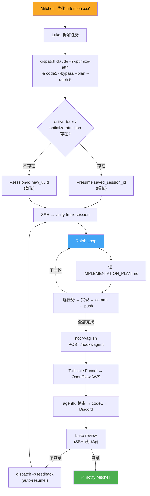

# Unity-Claude Dispatch Workflow — Mermaid 版

```mermaid
flowchart TD
    A["Mitchell: '优化 attention xxx'"] --> B["Luke: 拆解任务"]
    B --> C["dispatch claude -n optimize-attn\n-a code1 --bypass --plan --ralph 5"]
    
    C --> D{"active-tasks/\noptimize-attn.json\n存在?"}
    D -->|存在| E["--resume saved_session_id\n(续轮)"]
    D -->|不存在| F["--session-id new_uuid\n(首轮)"]
    
    E --> G["SSH → Unity tmux session"]
    F --> G
    
    G --> H["Ralph Loop"]
    H --> I["读 IMPLEMENTATION_PLAN.md"]
    I --> J["选任务 → 实现 → commit → push"]
    J -->|下一轮| H
    J -->|全部完成| K["notify-agi.sh\nPOST /hooks/agent"]
    
    K --> L["Tailscale Funnel → OpenClaw AWS"]
    L --> M["agentId 路由 → code1 → Discord"]
    
    M --> N["Luke review\n(SSH 读代码)"]
    N -->|不满意| O["dispatch -p feedback\n(auto-resume!)"]
    O --> G
    N -->|满意| P["✅ notify Mitchell"]

    style A fill:#f9a825,color:#000
    style P fill:#4caf50,color:#fff
    style H fill:#42a5f5,color:#fff
```
