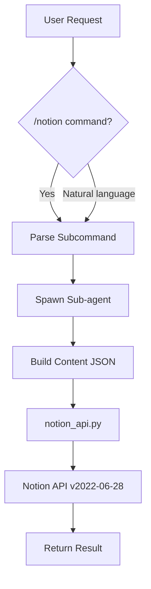

# 📝 Notion Writer

> OpenClaw skill for creating, reading, and managing Notion pages and databases

**Rich content blocks** · **Database operations** · **Background execution** · **Full CRUD support**

 

[English](README.md) | [简体中文](README_CN.md)

---

## ✨ Features

- **Create pages** — Add pages to Notion databases with rich content (tables, code blocks, lists, quotes)
- **Read & query** — Retrieve page content, search across workspace, filter database entries
- **Update pages** — Modify properties and append new content blocks to existing pages
- **Database integration** — Default AI tool database with status, priority, and assignee tracking
- **Background execution** — All operations run in sub-agents via `sessions_spawn` to avoid blocking
- **Rich formatting** — Support for headings, tables, code blocks, toggles, dividers, and more

## 🔄 How It Works



All operations are dispatched to a background sub-agent via `sessions_spawn`, keeping the main session responsive. The sub-agent prepares content as JSON blocks, then calls `notion_api.py` which handles authentication and API communication.

## 🚀 Quick Start

### Prerequisites

- Python 3.8+
- OpenClaw platform
- Notion integration token (pre-configured in skill)

### Usage

Trigger with `/notion` command or natural language:

```bash
# Create a page
"Create a Notion page titled 'Project Update' with a summary table"

# Read a page
/notion read https://notion.so/My-Page-abc123...

# Query database
/notion query

# Search workspace
/notion search "meeting notes"
```

The skill automatically spawns a sub-agent to handle the request. Results are returned when complete.

## 📖 Documentation

The skill uses the Notion API v2022-06-28. Refer to [Notion API documentation](https://developers.notion.com/reference/intro) for detailed block types and property structures.

Block examples are provided in [`references/block-examples.json`](references/block-examples.json).

## ⚙️ Configuration

Default configuration (set in `SKILL.md`):

| Setting | Value | Notes |
|---------|-------|-------|
| **Token** | `REDACTED` | Integration token |
| **Default Database** | `2f9871232f4580b6bf51e923c03cb30f` | AI tool database |
| **API Version** | `2022-06-28` | Notion API version |
| **Base URL** | `https://api.notion.com/v1` | API endpoint |

### Database Properties (AI tool)

| Property | Type | Options |
|----------|------|---------|
| Task name | title | Required |
| Description | rich_text | Optional |
| Status | status | "Not Started", "In progress", "Done" |
| Priority | select | Custom values |
| Due | date | Optional |
| Assignee | people | Optional |

## 📋 API Reference

### CLI Script

Located at `scripts/notion_api.py`:

```bash
# Create a page
python3 notion_api.py create --title "Title" --description "desc" \
  --status "In progress" --content-file /tmp/content.json

# Read a page
python3 notion_api.py read <page-id-or-url>

# Update a page
python3 notion_api.py update <page-id-or-url> --status "Done" \
  --content-file /tmp/new-content.json

# Query database
python3 notion_api.py query [database-id] --filter-status "In progress" --limit 10

# Search workspace
python3 notion_api.py search "keyword" --limit 5
```

### Content Blocks

Build content as JSON arrays. Common block types:

- `heading_2`, `heading_3` — Section headers
- `paragraph` — Text paragraphs
- `bulleted_list_item`, `numbered_list_item` — Lists
- `code` — Code blocks (specify `language`)
- `table` — Tables with header support (⚠️ prefer tables over lists for experiment data)
- `quote`, `divider`, `toggle` — Rich formatting

See [`references/block-examples.json`](references/block-examples.json) for templates.

## 🏗️ Project Structure

```
notion-writer/
├── SKILL.md                      # Skill configuration & usage guide
├── scripts/
│   └── notion_api.py             # Python CLI for Notion API
└── references/
    └── block-examples.json       # Content block templates
```

## 📄 License

No license file present. Check with the repository owner for licensing terms.

## 🙏 Acknowledgments

- Built for [OpenClaw](https://github.com/MitchellX/openclaw-luke) platform
- Uses [Notion API](https://developers.notion.com) v2022-06-28
