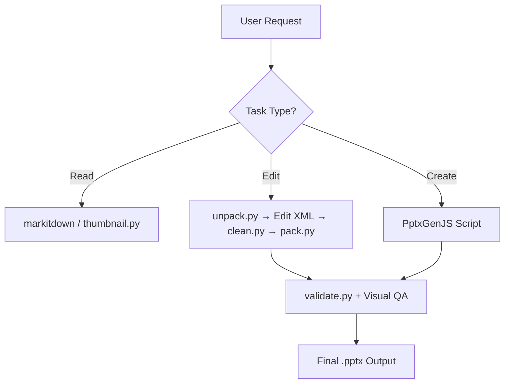

[简体中文](README_CN.md)

# 📊 PPTX Skill

   

A comprehensive Claude Code / OpenClaw skill for creating, reading, editing, and managing PowerPoint (.pptx) files. Handles everything from quick text extraction to building polished, designer-quality presentations from scratch.

## ✨ Features

- **Read & Extract** — Pull text from any `.pptx` via `markitdown`, generate visual thumbnail grids, or inspect raw XML
- **Edit with Templates** — Unpack existing presentations, manipulate slides at the XML level, and repack with validation
- **Create from Scratch** — Build new presentations using PptxGenJS with charts, icons, images, and professional layouts
- **XML Validation** — Schema-based validation against ISO/IEC 29500 and Microsoft Office extensions with auto-repair
- **Design System** — Built-in color palettes, typography guidelines, and layout patterns to prevent bland slides
- **QA Pipeline** — Automated content checks and visual inspection workflow to catch overlaps, overflow, and alignment issues

## 🔄 How It Works



1. **Read**: Extract text with `markitdown` or create visual overviews with `thumbnail.py`
2. **Edit**: Unpack the `.pptx` to XML, manipulate slides directly, clean orphaned files, and repack with validation
3. **Create**: Generate a Node.js script using PptxGenJS to build slides programmatically
4. All outputs go through a **QA pipeline** — content verification via `markitdown` plus visual inspection via LibreOffice rendering

## 📦 Dependencies

| Dependency | Purpose | Install |
|------------|---------|---------|
| [markitdown](https://github.com/microsoft/markitdown) | Text extraction from `.pptx` | `pip install "markitdown[pptx]"` |
| [Pillow](https://python-pillow.org/) | Thumbnail grid generation | `pip install Pillow` |
| [PptxGenJS](https://gitbrent.github.io/PptxGenJS/) | Create presentations from scratch | `npm install -g pptxgenjs` |
| [react-icons](https://react-icons.github.io/react-icons/) | SVG icons for slides | `npm install -g react-icons react react-dom sharp` |
| [LibreOffice](https://www.libreoffice.org/) | PDF/image conversion for QA | System package (`soffice`) |
| [Poppler](https://poppler.freedesktop.org/) | PDF to individual slide images | System package (`pdftoppm`) |
| [defusedxml](https://github.com/tiran/defusedxml) | Safe XML parsing for Office files | `pip install defusedxml` |

## 🚀 Quick Start

### Reading a Presentation

```bash
# Extract text content
python -m markitdown presentation.pptx

# Generate a visual thumbnail grid
python scripts/thumbnail.py presentation.pptx

# Inspect raw XML structure
python scripts/office/unpack.py presentation.pptx unpacked/
```

### Editing an Existing Presentation

```bash
# 1. Analyze the template
python scripts/thumbnail.py template.pptx
python -m markitdown template.pptx

# 2. Unpack
python scripts/office/unpack.py template.pptx unpacked/

# 3. Edit slide XML files in unpacked/ppt/slides/
#    (add/remove/reorder slides, update text content)

# 4. Clean orphaned files
python scripts/clean.py unpacked/

# 5. Repack with validation
python scripts/office/pack.py unpacked/ output.pptx --original template.pptx
```

### Creating from Scratch

Build a Node.js script using the PptxGenJS API — see [pptxgenjs.md](pptxgenjs.md) for the full tutorial covering text, shapes, images, charts, icons, and slide masters.

## 🏗️ Project Structure

```
pptx/
├── SKILL.md              # Skill definition and entry point
├── editing.md            # Template-based editing guide
├── pptxgenjs.md          # PptxGenJS creation tutorial
├── scripts/
│   ├── add_slide.py      # Duplicate slides or create from layouts
│   ├── clean.py          # Remove orphaned files from unpacked PPTX
│   ├── thumbnail.py      # Generate slide thumbnail grids
│   └── office/
│       ├── unpack.py     # Extract and pretty-print PPTX XML
│       ├── pack.py       # Repack with validation and XML condensing
│       ├── validate.py   # Schema validation with auto-repair
│       ├── soffice.py    # LibreOffice helper (sandboxed environments)
│       ├── helpers/      # XML processing utilities
│       ├── validators/   # PPTX/DOCX schema validators
│       └── schemas/      # ISO/IEC 29500 and Microsoft XSD schemas
└── LICENSE.txt           # Proprietary license (Anthropic)
```

## ⚙️ Script Reference

| Script | Usage | Description |
|--------|-------|-------------|
| `thumbnail.py` | `python scripts/thumbnail.py input.pptx [prefix] [--cols N]` | Create labeled thumbnail grid of slides |
| `unpack.py` | `python scripts/office/unpack.py input.pptx unpacked/` | Extract PPTX, pretty-print XML, escape smart quotes |
| `pack.py` | `python scripts/office/pack.py unpacked/ output.pptx --original input.pptx` | Validate, condense XML, create PPTX |
| `validate.py` | `python scripts/office/validate.py unpacked/ --original input.pptx` | Schema validation with optional auto-repair |
| `add_slide.py` | `python scripts/add_slide.py unpacked/ slide2.xml` | Duplicate slide or create from layout |
| `clean.py` | `python scripts/clean.py unpacked/` | Remove orphaned slides, media, and rels |

## 📄 License

Proprietary — © 2025 Anthropic, PBC. All rights reserved. See [LICENSE.txt](LICENSE.txt) for complete terms.
