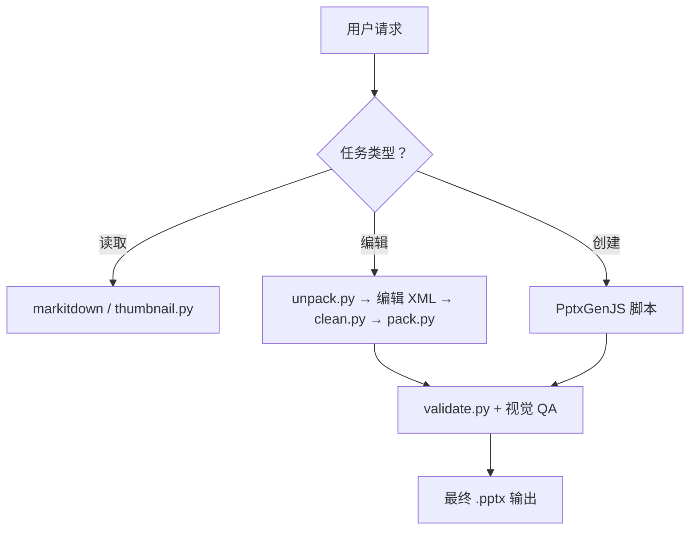

[English](README.md)

# 📊 PPTX 技能

   

一个全面的 Claude Code / OpenClaw 技能，用于创建、读取、编辑和管理 PowerPoint（.pptx）文件。从快速提取文本到从零构建精美的专业级演示文稿，全部搞定。

## ✨ 功能特点

- **读取与提取** — 通过 `markitdown` 从任意 `.pptx` 提取文本，生成缩略图网格，或查看原始 XML
- **模板编辑** — 解包现有演示文稿，在 XML 层级操作幻灯片，验证后重新打包
- **从零创建** — 使用 PptxGenJS 构建全新演示文稿，支持图表、图标、图片和专业布局
- **XML 验证** — 基于 ISO/IEC 29500 和 Microsoft Office 扩展的架构验证，支持自动修复
- **设计系统** — 内置配色方案、字体指南和布局模式，避免千篇一律的幻灯片
- **QA 流水线** — 自动化内容检查和视觉审查流程，捕捉元素重叠、溢出和对齐问题

## 🔄 工作流程



1. **读取**：用 `markitdown` 提取文本，或用 `thumbnail.py` 创建可视化概览
2. **编辑**：将 `.pptx` 解包为 XML，直接操作幻灯片，清理孤立文件，验证后重新打包
3. **创建**：生成 Node.js 脚本，通过 PptxGenJS 以编程方式构建幻灯片
4. 所有输出都经过 **QA 流水线** — 使用 `markitdown` 验证内容，通过 LibreOffice 渲染进行视觉检查

## 📦 依赖项

| 依赖 | 用途 | 安装方式 |
|------|------|---------|
| [markitdown](https://github.com/microsoft/markitdown) | 从 `.pptx` 提取文本 | `pip install "markitdown[pptx]"` |
| [Pillow](https://python-pillow.org/) | 生成缩略图网格 | `pip install Pillow` |
| [PptxGenJS](https://gitbrent.github.io/PptxGenJS/) | 从零创建演示文稿 | `npm install -g pptxgenjs` |
| [react-icons](https://react-icons.github.io/react-icons/) | 幻灯片中的 SVG 图标 | `npm install -g react-icons react react-dom sharp` |
| [LibreOffice](https://www.libreoffice.org/) | PDF/图片转换（QA 用） | 系统包（`soffice`） |
| [Poppler](https://poppler.freedesktop.org/) | PDF 转单页幻灯片图片 | 系统包（`pdftoppm`） |
| [defusedxml](https://github.com/tiran/defusedxml) | Office 文件的安全 XML 解析 | `pip install defusedxml` |

## 🚀 快速开始

### 读取演示文稿

```bash
# 提取文本内容
python -m markitdown presentation.pptx

# 生成缩略图网格
python scripts/thumbnail.py presentation.pptx

# 查看原始 XML 结构
python scripts/office/unpack.py presentation.pptx unpacked/
```

### 编辑现有演示文稿

```bash
# 1. 分析模板
python scripts/thumbnail.py template.pptx
python -m markitdown template.pptx

# 2. 解包
python scripts/office/unpack.py template.pptx unpacked/

# 3. 编辑 unpacked/ppt/slides/ 中的幻灯片 XML 文件
#    （增删、重排幻灯片，更新文本内容）

# 4. 清理孤立文件
python scripts/clean.py unpacked/

# 5. 验证并重新打包
python scripts/office/pack.py unpacked/ output.pptx --original template.pptx
```

### 从零创建

编写 Node.js 脚本使用 PptxGenJS API — 参阅 [pptxgenjs.md](pptxgenjs.md) 获取完整教程，涵盖文本、形状、图片、图表、图标和母版幻灯片。

## 🏗️ 项目结构

```
pptx/
├── SKILL.md              # 技能定义和入口
├── editing.md            # 基于模板的编辑指南
├── pptxgenjs.md          # PptxGenJS 创建教程
├── scripts/
│   ├── add_slide.py      # 复制幻灯片或从布局创建
│   ├── clean.py          # 清理解包后的孤立文件
│   ├── thumbnail.py      # 生成幻灯片缩略图网格
│   └── office/
│       ├── unpack.py     # 解包并格式化 PPTX XML
│       ├── pack.py       # 验证、压缩 XML 并重新打包
│       ├── validate.py   # Schema 验证与自动修复
│       ├── soffice.py    # LibreOffice 辅助工具（沙盒环境适配）
│       ├── helpers/      # XML 处理工具
│       ├── validators/   # PPTX/DOCX Schema 验证器
│       └── schemas/      # ISO/IEC 29500 和 Microsoft XSD Schema
└── LICENSE.txt           # 专有许可证（Anthropic）
```

## ⚙️ 脚本参考

| 脚本 | 用法 | 说明 |
|------|------|------|
| `thumbnail.py` | `python scripts/thumbnail.py input.pptx [prefix] [--cols N]` | 创建带标签的幻灯片缩略图网格 |
| `unpack.py` | `python scripts/office/unpack.py input.pptx unpacked/` | 解包 PPTX，格式化 XML，转义智能引号 |
| `pack.py` | `python scripts/office/pack.py unpacked/ output.pptx --original input.pptx` | 验证、压缩 XML、生成 PPTX |
| `validate.py` | `python scripts/office/validate.py unpacked/ --original input.pptx` | Schema 验证，支持自动修复 |
| `add_slide.py` | `python scripts/add_slide.py unpacked/ slide2.xml` | 复制幻灯片或从布局模板创建 |
| `clean.py` | `python scripts/clean.py unpacked/` | 清理孤立的幻灯片、媒体和关联文件 |

## 📄 许可证

专有许可 — © 2025 Anthropic, PBC. 保留所有权利。完整条款请参阅 [LICENSE.txt](LICENSE.txt)。
