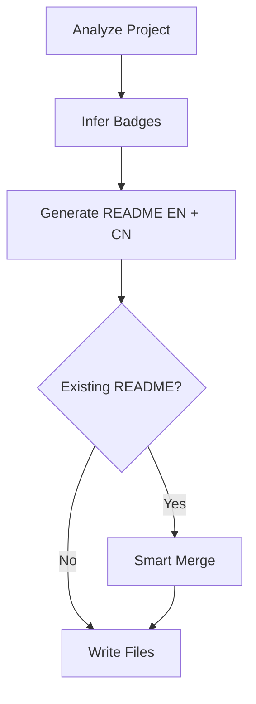

# 📝 README Generator

> Bilingual README generation for any GitHub project with auto-inferred badges and smart merge

**Auto-badge inference** · **Bilingual output** · **Smart merge** · **Workflow diagrams** · **OpenClaw native**

 

[English](README.md) | [简体中文](README_CN.md)

---

## ✨ Features

- **Auto-badge inference** — Scans your project files and generates appropriate shields.io badges for language, framework, license, CI/CD, and domain
- **Bilingual documentation** — Generates both README.md (English) and README_CN.md (简体中文) with natural, community-friendly language
- **Smart merge** — Preserves manual edits when updating existing READMEs, never silently deletes user-written content
- **Workflow diagrams** — Includes Mermaid flowcharts to visualize project architecture at a glance
- **Background execution** — Runs as a sub-agent via sessions_spawn, doesn't block the main conversation
- **Quick metadata collection** — Includes analyze_project.sh script for fast project analysis

## 🔄 How It Works



The skill analyzes your project structure, detects languages/frameworks/tools, generates appropriate badges, produces bilingual README files following best practices, and intelligently merges with existing content to preserve manual edits.

## 🚀 Quick Start

### Usage

Trigger the skill by asking:
- "generate readme for this project"
- "update the README"
- "/readme-generator"

Or spawn it as a background task:

```bash
sessions_spawn --label readme-gen --runtime agent:code2 --task "
Read the readme-generator skill at ~/.openclaw/workspace/skills/readme-generator/SKILL.md,
then generate README for the project at /path/to/your/project.
Write output files directly to the project directory.
"
```

### Quick Analysis

To quickly analyze a project without generating READMEs:

```bash
bash ~/.openclaw/workspace/skills/readme-generator/scripts/analyze_project.sh /path/to/project
```

## 🏗️ Project Structure

```
readme-generator/
├── SKILL.md                      # Main skill documentation
├── references/
│   ├── readme-format.md          # README template specification
│   └── badge-rules.md            # Badge inference rules
└── scripts/
    └── analyze_project.sh        # Project metadata analyzer
```

## 📖 Documentation

### Supported Badges

The skill auto-detects and generates badges for:

- **Languages**: Python, Node.js, TypeScript, Rust, Go, Java, Swift, Ruby, C/C++
- **Frameworks**: React, Next.js, Vue.js, FastAPI, Flask, Django, PyTorch, TensorFlow, Express
- **License**: MIT, Apache 2.0, GPL, BSD
- **CI/CD**: GitHub Actions, Travis CI, CircleCI
- **Package Registries**: npm, PyPI, crates.io
- **Domain-specific**: OpenClaw Skills, Claude Code, Plugins, Docker, MCP servers

See `references/badge-rules.md` for complete inference rules.

### README Structure

Generated READMEs follow a consistent structure:
- Title with emoji and tagline
- Feature highlights (3-5 key points)
- Badges (auto-inferred, max 6)
- Language switcher
- Features section
- How It Works (Mermaid diagram)
- Quick Start
- Optional sections: Documentation, Project Structure, Configuration, Testing, API, Roadmap, Contributing, Acknowledgments
- License

See `references/readme-format.md` for the complete template.

### Smart Merge Behavior

When updating an existing README:
1. Parses existing README into sections
2. Detects manual edits vs auto-generated content
3. Preserves user-written content
4. Updates auto-generated sections
5. Adds new sections at appropriate positions
6. Keeps orphaned sections at bottom under "## Other"
7. Adds `<!-- readme-generator: review -->` comments for changed structures

## ⚙️ Configuration

No configuration needed. The skill infers everything from your project files:
- Language/framework from package.json, setup.py, Cargo.toml, go.mod, etc.
- License from LICENSE file
- CI status from .github/workflows/
- Git repository from `git remote -v`
- Entry points from package.json "scripts", setup.py, Makefile, etc.

## 🗺️ Roadmap

- [ ] Support for more languages (PHP, Kotlin, Scala, Elixir)
- [ ] Custom badge templates
- [ ] Section ordering customization
- [ ] Badge priority rules per domain
- [ ] Multi-language support beyond EN/CN (ES, JP, FR)
- [ ] Integration with git hooks for auto-updates

## 🤝 Contributing

This skill is part of the [awesome-skills](https://github.com/MitchellX/awesome-skills) repository at `openclaw-skills/readme-generator/`.

To improve this skill:
1. Fork the repository
2. Make your changes
3. Test with various project types
4. Submit a pull request

## 🙏 Acknowledgments

- Built for OpenClaw, the agentic automation platform
- Inspired by GitHub community README best practices
- Badge templates from [shields.io](https://shields.io)
