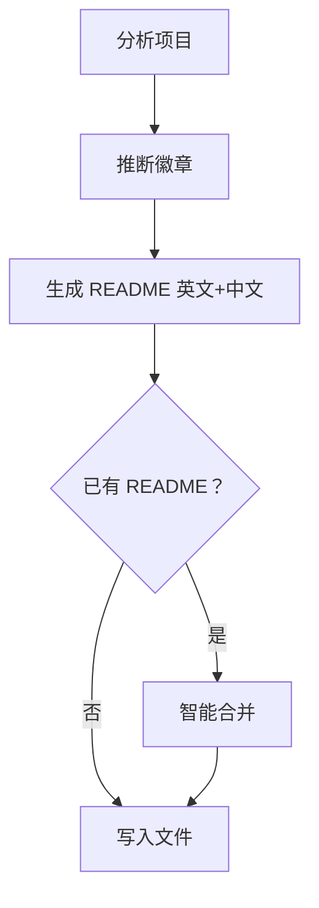

# 📝 README 生成器

> 为任何 GitHub 项目生成双语 README，自动推断徽章，智能合并

**自动徽章推断** · **双语输出** · **智能合并** · **工作流程图** · **OpenClaw 原生技能**

 

[English](README.md) | [简体中文](README_CN.md)

---

## ✨ 功能特性

- **自动徽章推断** — 扫描项目文件，自动生成适合的 shields.io 徽章（语言、框架、许可证、CI/CD、领域标签）
- **双语文档** — 同时生成 README.md（英文）和 README_CN.md（简体中文），使用自然、符合社区习惯的表达
- **智能合并** — 更新现有 README 时保留手动编辑的内容，绝不会悄悄删除用户写的东西
- **工作流程图** — 包含 Mermaid 流程图，让读者一眼看懂项目架构
- **后台执行** — 通过 sessions_spawn 作为子 agent 运行，不阻塞主对话
- **快速元数据收集** — 内置 analyze_project.sh 脚本，快速分析项目结构

## 🔄 工作原理



该技能会分析项目结构，检测语言/框架/工具，生成合适的徽章，按最佳实践产出双语 README 文件，并智能合并现有内容以保留手动编辑。

## 🚀 快速开始

### 使用方法

通过以下方式触发该技能：
- "给这个项目生成 readme"
- "更新 README"
- "/readme-generator"

或者作为后台任务启动：

```bash
sessions_spawn --label readme-gen --runtime agent:code2 --task "
Read the readme-generator skill at ~/.openclaw/workspace/skills/readme-generator/SKILL.md,
then generate README for the project at /path/to/your/project.
Write output files directly to the project directory.
"
```

### 快速分析

只想分析项目而不生成 README：

```bash
bash ~/.openclaw/workspace/skills/readme-generator/scripts/analyze_project.sh /path/to/project
```

## 🏗️ 项目结构

```
readme-generator/
├── SKILL.md                      # 主技能文档
├── references/
│   ├── readme-format.md          # README 模板规范
│   └── badge-rules.md            # 徽章推断规则
└── scripts/
    └── analyze_project.sh        # 项目元数据分析器
```

## 📖 文档

### 支持的徽章

该技能自动检测并生成以下徽章：

- **语言**：Python、Node.js、TypeScript、Rust、Go、Java、Swift、Ruby、C/C++
- **框架**：React、Next.js、Vue.js、FastAPI、Flask、Django、PyTorch、TensorFlow、Express
- **许可证**：MIT、Apache 2.0、GPL、BSD
- **CI/CD**：GitHub Actions、Travis CI、CircleCI
- **包注册表**：npm、PyPI、crates.io
- **领域特定**：OpenClaw Skills、Claude Code、插件、Docker、MCP 服务器

完整推断规则请查看 `references/badge-rules.md`。

### README 结构

生成的 README 遵循统一结构：
- 带 emoji 的标题 + 一句话简介
- 功能亮点（3-5 个关键点）
- 徽章（自动推断，最多 6 个）
- 语言切换器
- 功能特性章节
- 工作原理（Mermaid 流程图）
- 快速开始
- 可选章节：文档、项目结构、配置、测试、API、路线图、贡献指南、致谢
- 许可证

完整模板请查看 `references/readme-format.md`。

### 智能合并行为

更新现有 README 时：
1. 将现有 README 解析为章节
2. 检测手动编辑内容 vs 自动生成内容
3. 保留用户编写的内容
4. 更新自动生成的章节
5. 在合适位置添加新章节
6. 将孤立章节保留在底部的「## 其他」下
7. 为结构变化的地方添加 `<!-- readme-generator: review -->` 注释

## ⚙️ 配置

无需配置，技能会从项目文件自动推断一切：
- 从 package.json、setup.py、Cargo.toml、go.mod 等推断语言/框架
- 从 LICENSE 文件推断许可证
- 从 .github/workflows/ 推断 CI 状态
- 从 `git remote -v` 推断 Git 仓库
- 从 package.json "scripts"、setup.py、Makefile 等推断入口点

## 🗺️ 路线图

- [ ] 支持更多语言（PHP、Kotlin、Scala、Elixir）
- [ ] 自定义徽章模板
- [ ] 章节排序自定义
- [ ] 按领域的徽章优先级规则
- [ ] 支持更多语言（除英文/中文外，如西班牙语、日语、法语）
- [ ] 集成 git hooks 实现自动更新

## 🤝 贡献指南

本技能是 [awesome-skills](https://github.com/MitchellX/awesome-skills) 仓库的一部分，位于 `openclaw-skills/readme-generator/`。

改进本技能：
1. Fork 该仓库
2. 进行修改
3. 用各种类型的项目测试
4. 提交 pull request

## 🙏 致谢

- 为 OpenClaw 智能自动化平台构建
- 灵感来自 GitHub 社区 README 最佳实践
- 徽章模板来自 [shields.io](https://shields.io)
