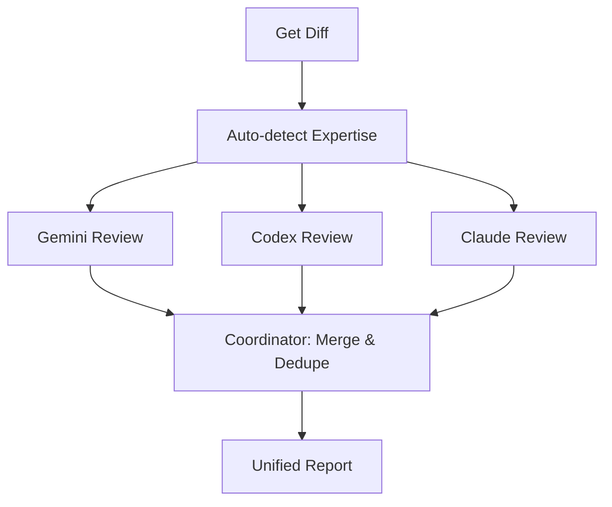

# README Generator

Analyze a project directory, then generate or update bilingual README files (English + 简体中文).

## Workflow

### Step 1: Analyze Project

Scan the target directory to collect metadata:

1. **File tree**: `find <dir> -maxdepth 3 -not -path '*/.git/*' -not -path '*/node_modules/*' -not -path '*/__pycache__/*' -not -path '*/venv/*'`
2. **Key files** (read if present):
   - `package.json`, `setup.py`, `pyproject.toml`, `Cargo.toml`, `go.mod`, `Makefile`, `CMakeLists.txt`
   - `SKILL.md`, `CLAUDE.md`, `plugin.json`
   - `LICENSE`, `.github/workflows/*.yml`
   - Existing `README.md`, `README_CN.md`
3. **Infer metadata**:
   - Project name, description, primary language/framework
   - License type (from LICENSE file or package metadata)
   - Dependencies and tech stack
   - Entry points and commands
   - CI/CD presence

### Step 2: Infer Badges

Auto-generate shields.io badges based on detected metadata. See `references/badge-rules.md` for the full inference table.

Common badges (include when applicable):
- Language/runtime (Python, Node.js, Rust, Go, etc.)
- Framework (React, FastAPI, PyTorch, etc.)
- License (MIT, Apache-2.0, etc.)
- CI status (GitHub Actions)
- Package registry (npm, PyPI, crates.io)
- Special domain tags (Claude Code, OpenClaw, Plugin, etc.)

### Step 3: Generate README

**⚠️ 无论 create 还是 update，始终生成/更新双语版本：**
- **README.md** — English
- **README_CN.md** — 简体中文 (not word-for-word translation; natural Chinese with localized examples)

如果只有 README.md 没有 README_CN.md，也必须补上中文版。反之亦然。

Each file links to the other via a language switcher at the top.

#### Workflow Diagram (required)

After the Features section, include a **"🔄 How It Works"** section with a Mermaid flowchart showing the skill/project's pipeline. This helps readers instantly grasp the architecture.

Rules for the diagram:
- Use `flowchart TD` (top-down) for pipelines, `flowchart LR` (left-right) for simple chains
- Show key steps as nodes, parallel operations as branches
- Keep it to 3-8 nodes (not too detailed)
- Use short labels inside nodes
- Add a 1-2 sentence explanation below if the diagram isn't self-explanatory
- For parallel operations, use Mermaid's branching syntax

Example for a multi-agent review skill:
````markdown

````

### Step 4: Smart Merge (if README already exists)

When an existing README is found:

1. Parse existing README into sections (split by `## ` headings)
2. Identify sections with **manual edits** (content that doesn't match auto-generated patterns)
3. For each section:
   - **Auto-generated section unchanged** → replace with new version
   - **Section has manual edits** → preserve manual content, append a `<!-- readme-generator: review -->` comment if structure changed
   - **New section not in old README** → append at appropriate position
   - **Old section not in new template** → keep at bottom under `## Other`
4. Never delete user-written content silently

### Step 5: Write Files & Push

Write README.md and README_CN.md to the project directory, then **immediately commit and push**:

```bash
cd <project_dir>
git add README.md README_CN.md
git commit -m "docs: update README with readme-generator"
git push
```

Show a summary of what changed:
```
✅ README.md — generated (new)
✅ README_CN.md — generated (new)
✅ Pushed to origin
```
or for updates:
```
✅ README.md — updated (3 sections refreshed, 2 preserved)
✅ README_CN.md — updated (3 sections refreshed, 2 preserved)
✅ Pushed to origin
```

**Never leave generated files uncommitted.** Always push after writing.

## Running via sessions_spawn

This skill runs in a background sub-agent. Example spawn task:

```
Read the readme-generator skill at ~/.openclaw/workspace/skills/readme-generator/SKILL.md, then generate README for the project at <TARGET_DIR>. Write output files directly to the project directory.
```

For updates:
```
Read the readme-generator skill at ~/.openclaw/workspace/skills/readme-generator/SKILL.md, then update the existing README for <TARGET_DIR>. Use smart merge to preserve manual edits.
```

## Style Guide

- **Tone**: Professional but approachable, not robotic
- **English README**: Standard technical writing
- **Chinese README**: Natural 简体中文, not machine-translated. Use Chinese tech community conventions (e.g., 安装, 快速开始, 使用说明)
- **Emoji**: Use sparingly in section headings only (✨ 📦 🚀 ⚙️ 🏗️ 📄 🤝)
- **Code blocks**: Always include language identifier
- **Links**: Wrap multiple URLs in `<>` for Discord compatibility
