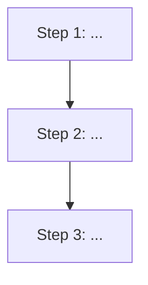

# README Format Specification

## Structure

Every generated README follows this layout. Sections marked (conditional) are included only when relevant.

```markdown
# {emoji} {Project Name}

> {One-line description — what it does, not how}

**{Feature1}** · **{Feature2}** · **{Feature3}** · **{Feature4}**

{badges on one line, separated by spaces}

[English](README.md) | [简体中文](README_CN.md)

---

## ✨ Features

- **{Feature name}** — {one sentence}
- **{Feature name}** — {one sentence}
- ...

## 🔄 How It Works

{Workflow diagram showing the skill's pipeline/architecture. Use Mermaid flowchart syntax for GitHub rendering.}



{Brief 1-2 sentence explanation below the diagram if needed.}

## 🚀 Quick Start

### Prerequisites (conditional)

- {dependency 1}
- {dependency 2}

### Installation

{install commands in code block}

### Usage

{minimal working example in code block}

## 📖 Documentation (conditional)

{link to docs site or detailed usage guide}

## 🏗️ Project Structure (conditional)

{tree view of key directories, max 2 levels deep}

## ⚙️ Configuration (conditional)

{config options table or description}

## 🧪 Testing (conditional)

{how to run tests}

## 📋 API Reference (conditional)

{key APIs or CLI commands}

## 🗺️ Roadmap (conditional)

{planned features}

## 🤝 Contributing (conditional)

{contribution guidelines or link}

## 📄 License

{license type with link}

## 🙏 Acknowledgments (conditional)

{credits}
```

## Section Rules

### Title Block (required)

```markdown
# 🔍 ProjectName

> Lightweight, fast, and extensible project analysis tool

**Multi-source search** · **6-dimension analysis** · **Quality scorecard** · **Bilingual**

[](#)
[](LICENSE)
[](...)

[English](README.md) | [简体中文](README_CN.md)
```

Rules:
- Emoji before project name: pick ONE that represents the project's domain
- Description: max 15 words, starts with adjective or verb
- Feature highlights: 3-5 key features, bold, separated by ` · `
- Badges: on a single line, no more than 6
- Language switcher: always present even if only English exists initially

### Features Section (required)

List 4-8 features. Each feature:
- Bold name + em dash + one sentence explanation
- No sub-bullets (keep flat)
- Order by importance

### Quick Start (required)

Must contain a **working** code example that a user can copy-paste. Include:
- Install command
- Minimal usage (3-5 lines max)

### Project Structure (conditional)

Include when project has ≥5 directories. Use tree format:
```
project/
├── src/          # Source code
├── tests/        # Test suite
├── docs/         # Documentation
└── scripts/      # Utility scripts
```
Max 2 levels deep. Add inline comments for non-obvious directories.

### Configuration (conditional)

Include when project has config files (.env, config.yaml, etc.). Use a table:
```markdown
| Option | Default | Description |
|--------|---------|-------------|
| `port` | `3000` | Server port |
```

## Chinese README Conventions

The 简体中文 version (README_CN.md) follows the same structure with these adaptations:

| English Section | Chinese Section |
|----------------|-----------------|
| Features | ✨ 功能特性 |
| Quick Start | 🚀 快速开始 |
| Documentation | 📖 文档 |
| Project Structure | 🏗️ 项目结构 |
| Configuration | ⚙️ 配置 |
| Testing | 🧪 测试 |
| API Reference | 📋 API 参考 |
| Roadmap | 🗺️ 路线图 |
| Contributing | 🤝 贡献指南 |
| License | 📄 许可证 |
| Acknowledgments | 🙏 致谢 |

Additional Chinese rules:
- Use 中文标点（，。；：！？）not English punctuation
- Technical terms keep English: API, CLI, GitHub, npm, Docker
- Code blocks identical to English version (code is code)
- 不要翻译成机翻味道，用自然的技术社区用语
- Badge text stays in English (shields.io doesn't localize well)
