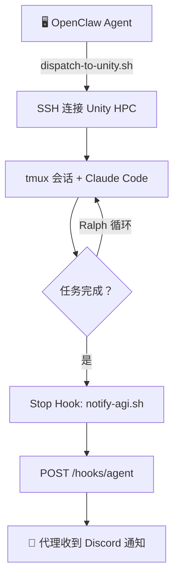

# unity-claude

**[English](README.md) | [简体中文](README_CN.md)**

[](https://opensource.org/licenses/MIT)


通过 SSH 将 Claude Code 任务派发到远程 HPC 集群（Unity）。发射即忘，任务完成后通过 Webhook 即时通知。基于 [OpenClaw](https://github.com/nicobailon/openclaw) 的技能插件。

## ✨ 功能特性

- **发射即忘** — 通过 SSH + tmux 派发任务，无需守着，完成后自动通知
- **自动恢复会话** — 相同任务名自动恢复上次会话（节省 token，保留上下文）
- **计划模式** (`--plan`) — CC 先创建 `IMPLEMENTATION_PLAN.md` 再开始编码
- **进度日志** (`--progress`) — CC 将经验教训写入 `PROGRESS.md`
- **Ralph 循环** (`--ralph N`) — N 轮迭代，每轮全新上下文，计划文件作为共享状态
- **Git Worktree 隔离** (`--worktree`) — 同一仓库并行任务互不冲突
- **Superpower / Agent Teams** — 通过 CC 原生子代理系统实现多智能体协作
- **即时通知** — Webhook → OpenClaw `/hooks/agent`（零轮询）
- **按代理路由** — `-a` 参数将完成通知路由到指定的 OpenClaw 代理

## 🔄 工作流程



1. 派发器通过 SSH 连接 Unity，写入任务元数据，并在 tmux 会话中启动 Claude Code。
2. CC 完成后，Stop Hook 立即触发，向 OpenClaw 的 Webhook 端点发送 POST 请求。
3. OpenClaw 将通知路由到指定代理（由 `-a` 参数指定），代理将结果推送到 Discord。

## ⚙️ 参数说明

| 参数 | 说明 |
|------|------|
| `-p "prompt"` | 任务提示词（必填） |
| `-n name` | 任务名称（用于会话追踪和通知路由） |
| `-a agent` | 完成后通知的代理（必填） |
| `-w /path` | 远程主机上的工作目录 |
| `--bypass` | 绕过权限确认模式 |
| `--plan` | 计划模式：先创建 `IMPLEMENTATION_PLAN.md` |
| `--progress` | 将经验教训记录到 `PROGRESS.md` |
| `--ralph N` | 循环 N 轮，每轮使用全新上下文 |
| `--worktree NAME` | Git worktree 隔离，支持并行任务 |
| `--new` | 强制创建新会话 |
| `--resume UUID` | 恢复指定会话 |
| `--clean` | 清除该任务名的已保存会话 |

## 🚀 使用方法

### 简单派发

```bash
bash dispatch-to-unity.sh \
  -p "优化 attention 模块" \
  -n "optimize-attn" -a "main" \
  -w "~/LightningDiT" --bypass
```

### 完整 Ralph 工作流（计划 + 循环 + 进度）

```bash
bash dispatch-to-unity.sh \
  -p "实现 VSA 训练流水线" \
  -n "vsa-train" -a "main" \
  -w "~/VSA" --bypass --plan --progress --ralph 5
```

### Worktree 隔离并行任务

```bash
# 任务 A 在 .worktrees/refactor-attn/ 中工作
bash dispatch-to-unity.sh \
  -p "重构 linear attention" \
  -n "refactor-attn" -a "code1" \
  -w "~/LightningDiT" --bypass --worktree "refactor-attn"

# 任务 B 在 .worktrees/add-bench/ 中工作（同一仓库，互不冲突）
bash dispatch-to-unity.sh \
  -p "添加新的 benchmark" \
  -n "add-bench" -a "code2" \
  -w "~/LightningDiT" --bypass --worktree "add-bench"
```

### 多轮审查（裁判模式）

```bash
# 第 1 轮：带计划模式派发
bash dispatch-to-unity.sh \
  -p "实现功能 X" -n "feature-x" -a "code1" \
  -w "~/Project" --bypass --plan --ralph 5

# 代理通过 SSH 审查完成后的代码...
# 第 2 轮：自动恢复同一会话，附带反馈
bash dispatch-to-unity.sh \
  -p "修复 handler.py 中的边界情况" -n "feature-x" -a "code1" \
  -w "~/Project" --bypass
```

## 🏗️ 目录结构

```
unity-claude/
├── README.md                     # 英文文档
├── README_CN.md                  # 中文文档
├── SKILL.md                      # 技能定义文件
└── references/
    ├── architecture.md           # 系统架构详情
    ├── git-worktree.md           # Git worktree 隔离指南
    └── superpower.md             # Agent Teams / Superpower 模式
```

## 📦 前置要求

- 已安装并配置 [OpenClaw](https://github.com/nicobailon/openclaw)
- 有远程 HPC 集群的 SSH 访问权限
- 远程主机已安装 [Claude Code CLI](https://docs.anthropic.com/en/docs/claude-code)
- 已配置 Tailscale Funnel 或其他 Webhook 回调方案

## 📄 许可证

MIT License
