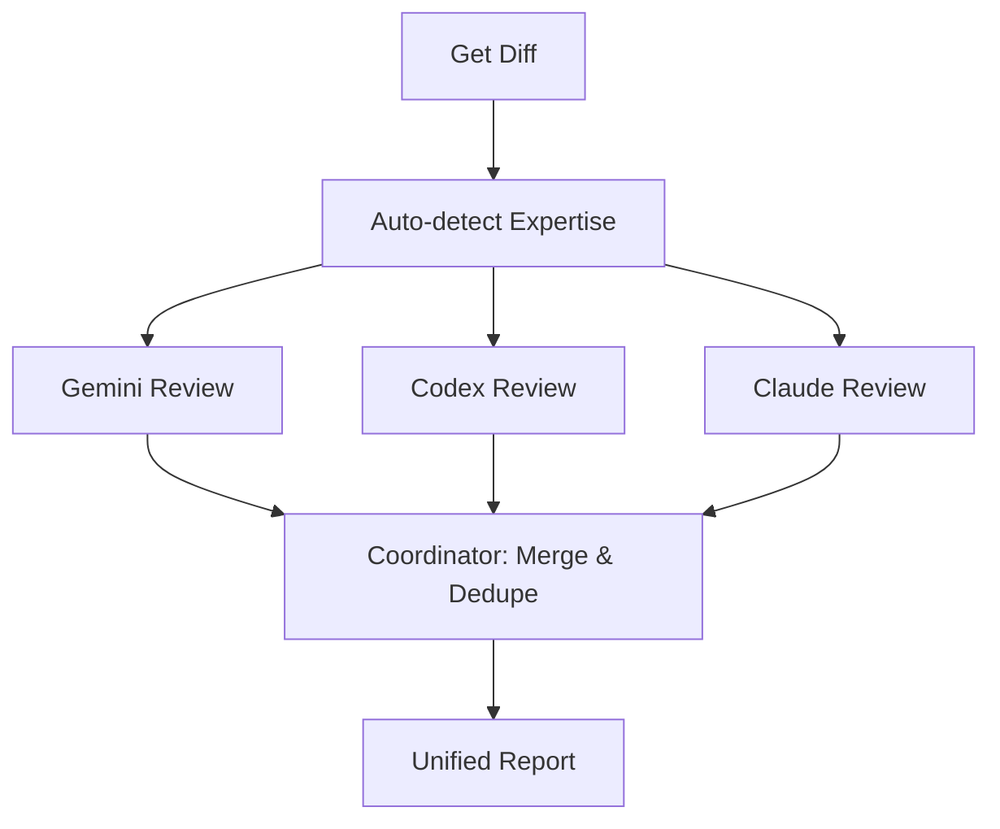

# 🔍 Diff Review

> Multi-agent code review using Gemini, Codex, and Claude in parallel

**Multi-Agent Review** · **Expertise Auto-Detection** · **Unified Reports** · **Commit or Diff**

 

[English](README.md) | [简体中文](README_CN.md)

---

## ✨ Features

- **Parallel Multi-Agent Review** — Run Gemini, Codex, and Claude reviewers simultaneously for comprehensive code analysis
- **Smart Expertise Detection** — Automatically identifies code domains (ML/AI, security, performance) and applies specialized review prompts
- **Unified Report Generation** — Merges findings from all reviewers, deduplicates issues, and sorts by severity
- **Flexible Review Targets** — Review specific commits by hash or analyze all uncommitted changes
- **Fallback Resilience** — Continues with available reviewers if some fail, never blocks on single-agent errors
- **Source Attribution** — Shows which reviewer(s) found each issue for transparency and trust building

## 🔄 How It Works



The skill fetches your git diff, analyzes code patterns to detect specialized domains (ML/AI, security, performance), then dispatches three reviewers in parallel. A coordinator agent merges their findings, removes duplicates, sorts by severity, and generates a unified markdown report with source attribution.

## 🚀 Quick Start

### Prerequisites

Install at least one of the following CLI tools:
- [Gemini CLI](https://github.com/google/generative-ai) (recommended)
- [Codex CLI](https://github.com/anthropics/anthropic-tools)
- Claude Code session (built-in)

### Usage

Review uncommitted changes with all agents:
```bash
/diff-review
```

Review a specific commit:
```bash
/diff-review abc123f
```

Use a single reviewer:
```bash
/diff-review --reviewer=gemini
/diff-review --reviewer=codex
/diff-review --reviewer=claude
```

Auto-select best reviewer based on code type:
```bash
/diff-review --reviewer=auto
```

## 📖 Documentation

### Command Syntax

```
/diff-review [<commit-hash>] [--reviewer=<mode>]
```

**Parameters:**
- `<commit-hash>` (optional): Full or short commit hash to review. Omit to review uncommitted changes.
- `--reviewer` (optional): 
  - `all` (default): Multi-agent mode with parallel execution
  - `auto`: Auto-select best reviewer based on code patterns
  - `gemini`, `codex`, `claude`: Use single reviewer only

### Review Workflow

1. **Parse Parameters** — Determine review target (commit or diff) and reviewer mode
2. **Get Git Diff** — Extract changes with stats and metadata
3. **Auto-detect Expertise** — Match code patterns to specialized review prompts
4. **Execute Review** — Run reviewers in parallel (multi-agent) or single mode
5. **Coordinate & Merge** — Deduplicate issues and generate unified report
6. **Save Report** — Output to terminal and write to timestamped file

### Expertise Areas

The skill automatically detects and applies specialized review logic for:
- **Machine Learning / AI** — Training loops, model architecture, data handling
- **Security** — Authentication, input validation, sensitive data exposure
- **Performance** — Algorithmic efficiency, resource management, caching

Expertise detection rules are defined in `expertise/_index.md`.

## 🏗️ Project Structure

```
diff-review/
├── SKILL.md              # Main skill documentation
├── expertise/            # Domain-specific review prompts
│   ├── _index.md         # Detection rules
│   └── training.md       # ML/AI training expertise
├── reviewers/            # Reviewer role definitions
│   ├── gemini-role.md    # Gemini CLI reviewer
│   ├── codex-role.md     # Codex CLI reviewer
│   ├── claude-role.md    # Claude reviewer
│   └── coordinator.md    # Multi-agent coordinator
└── templates/
    └── report.md         # Report format template
```

## 📋 Output Format

Generated reports include:

- **Review Summary** — Target (commit or uncommitted), timestamp, reviewer sources
- **Severity Breakdown** — Counts of Critical/High/Medium/Low issues
- **Merged Issues** — Deduplicated findings sorted by severity with source attribution
- **Raw Outputs** — Collapsible sections with full individual reviewer results

Reports are saved as:
- Commit reviews: `diff-review-<short-hash>-YYYYMMDD-HHMMSS.md`
- Uncommitted: `diff-review-YYYYMMDD-HHMMSS.md`

## ⚙️ Configuration

### Customizing Reviewers

Edit reviewer role files to adjust focus areas:
- `reviewers/gemini-role.md` — Gemini's review instructions
- `reviewers/codex-role.md` — Codex's review instructions
- `reviewers/claude-role.md` — Claude's review instructions

### Adding New Expertise

To add domain-specific review logic:

1. Create new expertise file in `expertise/` (e.g., `expertise/frontend.md`)
2. Update `expertise/_index.md` with detection patterns:
   ```markdown
   ## Frontend Development
   - Trigger patterns: `React`, `Vue`, `component`, `useState`
   - File patterns: `*.tsx`, `*.jsx`, `*.vue`
   - Prompt file: `expertise/frontend.md`
   ```

## 🤝 Contributing

This skill is part of the [awesome-skills](https://github.com/MitchellX/awesome-skills) collection. Contributions welcome!

To suggest improvements:
1. Review the skill structure in `SKILL.md`
2. Test changes with `/diff-review` on sample commits
3. Submit PR to the main repository

## 📄 License

This skill is part of the awesome-skills repository. Check the main repository for license information.

---

**Part of:** [awesome-skills](https://github.com/MitchellX/awesome-skills)  
**Repository:** `skills/diff-review/`
