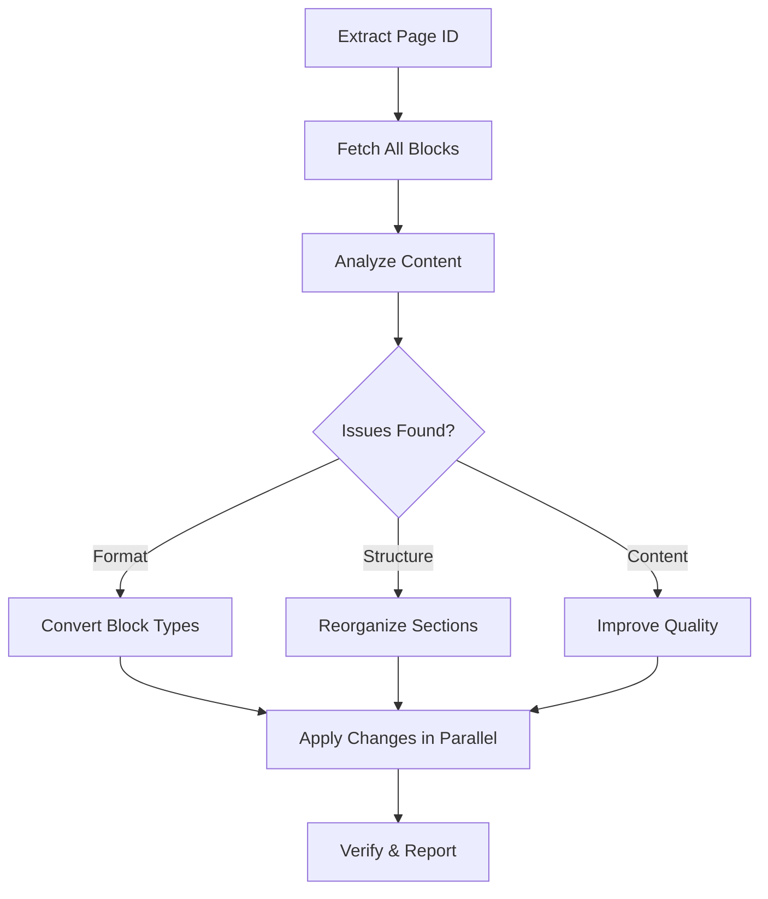

# 📝 Notion Organizer

> Automatically analyze and optimize Notion page content, formatting, and structure with one click

**Format Correction** · **Structure Reorganization** · **Content Quality** · **Smart Detection**

  

[English](README.md) | [简体中文](README_CN.md)

---

## ✨ Features

- **Automatic Format Detection** — Identifies code, diagrams, formulas, and structural elements in plain text blocks
- **Smart Type Conversion** — Converts paragraphs to proper block types (code, headings, lists) based on content
- **Structure Optimization** — Reorganizes flat content into logical hierarchies with proper headings and sections
- **Content Enhancement** — Consolidates redundant text, clarifies vague descriptions, and fills missing context
- **Parallel API Calls** — Executes multiple Notion API operations simultaneously for fast processing

## 🔄 How It Works



The skill analyzes each block against format, structure, and content quality criteria, then executes targeted replacements using Notion's API.

## 🚀 Quick Start

### Prerequisites

- OpenClaw with Notion MCP server configured
- Notion integration with page edit permissions

### Usage

Simply share a Notion page URL with your assistant and mention one of these triggers:

```
"Organize my Notion page"
"Clean up this Notion: https://notion.so/..."
"Format this Notion link"
"整理这个 Notion 页面"
```

The skill will:
1. Extract the page ID from the URL
2. Read all blocks
3. Detect issues (wrong block types, poor structure, content problems)
4. Apply fixes automatically
5. Report changes made

## 📖 Block Type Decision Guide

| Content Type | Converted To | Example |
|--------------|-------------|---------|
| Code snippets, API calls | `code` block | `self.qkv = nn.Linear(dim, dim*3)` |
| Flow diagrams (box-drawing) | `code` block | `├─ step1 → step2` |
| Math formulas, tensor shapes | `code` block | `φ(x) = elu(x) + 1` |
| Section titles | `heading_2` | `═══ Section Name ═══` |
| Sub-section titles | `heading_3` | `--- Subsection ---` |
| Lists and enumerations | `bulleted_list_item` | Feature lists, options |
| Normal explanatory text | `paragraph` | Descriptions, prose |

## ⚙️ Configuration

The skill follows these rules by default:

- **Content Language**: Chinese (中文) for all Notion text content
- **Code Block Language**: `"plain text"` for diagrams/formulas, actual language names for code
- **Character Limit**: Max 2000 chars per rich_text object (auto-splits longer content)
- **Operation Strategy**: Targeted replacement (delete + insert) rather than full rewrite

## 🏗️ Project Structure

```
notion-organizer/
├── SKILL.md                    # Main skill documentation
├── references/
│   └── notion-api-patterns.md  # Notion MCP tool reference
├── scripts/                    # (empty, reserved for future automation)
└── assets/                     # (empty, reserved for examples)
```

## 📋 API Operations

The skill uses these Notion MCP operations:

- **get-block-children** — Read all blocks from a page (with pagination)
- **delete-block** — Remove blocks that need type conversion or reorganization
- **append-block-children** — Insert new blocks with correct types

Operations are parallelized where safe (no race conditions on `after` anchors).

## 🤝 Related Skills

- **notion-writer** — Create new pages and content
- **paper-review** — Review LaTeX documents
- **techdebt** — Analyze code quality

---

**Repository**: [MitchellX/awesome-skills](https://github.com/MitchellX/awesome-skills)
