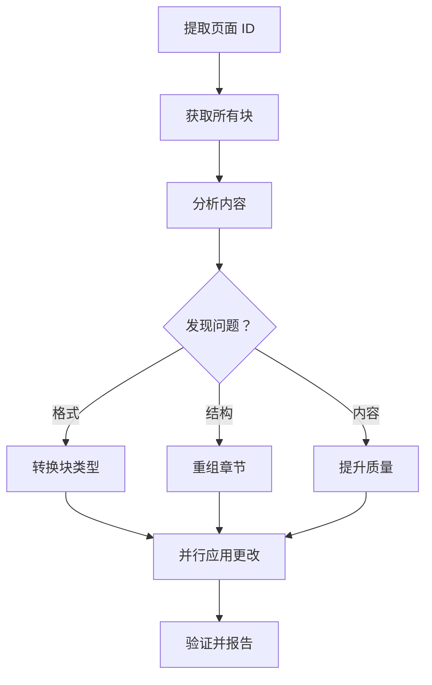

# 📝 Notion Organizer

> 一键自动分析和优化 Notion 页面的内容、格式和结构

**格式修正** · **结构重组** · **内容质量提升** · **智能检测**

  

[English](README.md) | [简体中文](README_CN.md)

---

## ✨ 功能特性

- **自动格式检测** — 识别纯文本块中的代码、流程图、公式和结构化元素
- **智能类型转换** — 根据内容自动将段落转换为正确的块类型（代码、标题、列表）
- **结构优化** — 将扁平内容重组为逻辑层次，添加合适的标题和章节
- **内容增强** — 合并冗余文本，澄清模糊描述，补充缺失上下文
- **并行 API 调用** — 同时执行多个 Notion API 操作，快速完成处理

## 🔄 工作原理



该技能根据格式、结构和内容质量标准分析每个块，然后使用 Notion API 执行针对性替换。

## 🚀 快速开始

### 前置条件

- 已配置 Notion MCP server 的 OpenClaw
- 具有页面编辑权限的 Notion integration

### 使用方法

只需向你的助手分享 Notion 页面链接，并提到以下触发词之一：

```
"Organize my Notion page"
"Clean up this Notion: https://notion.so/..."
"Format this Notion link"
"整理这个 Notion 页面"
```

技能会自动：
1. 从 URL 提取页面 ID
2. 读取所有块
3. 检测问题（错误的块类型、差劲的结构、内容问题）
4. 自动应用修复
5. 报告所做的更改

## 📖 块类型决策指南

| 内容类型 | 转换为 | 示例 |
|---------|--------|------|
| 代码片段、API 调用 | `code` 块 | `self.qkv = nn.Linear(dim, dim*3)` |
| 流程图（框线字符） | `code` 块 | `├─ step1 → step2` |
| 数学公式、张量形状 | `code` 块 | `φ(x) = elu(x) + 1` |
| 章节标题 | `heading_2` | `═══ 章节名称 ═══` |
| 子章节标题 | `heading_3` | `--- 子章节 ---` |
| 列表和枚举 | `bulleted_list_item` | 功能列表、选项 |
| 普通说明文字 | `paragraph` | 描述、散文 |

## ⚙️ 配置

技能默认遵循以下规则：

- **内容语言**：Notion 文本内容使用中文（中文）
- **代码块语言**：图表/公式使用 `"plain text"`，代码使用实际语言名称
- **字符限制**：每个 rich_text 对象最多 2000 字符（自动拆分更长的内容）
- **操作策略**：针对性替换（删除 + 插入），而非完全重写

## 🏗️ 项目结构

```
notion-organizer/
├── SKILL.md                    # 主技能文档
├── references/
│   └── notion-api-patterns.md  # Notion MCP 工具参考
├── scripts/                    # （空，预留给未来的自动化）
└── assets/                     # （空，预留给示例）
```

## 📋 API 操作

技能使用以下 Notion MCP 操作：

- **get-block-children** — 从页面读取所有块（带分页）
- **delete-block** — 删除需要类型转换或重组的块
- **append-block-children** — 插入具有正确类型的新块

在安全的情况下并行执行操作（`after` 锚点无竞态条件）。

## 🤝 相关技能

- **notion-writer** — 创建新页面和内容
- **paper-review** — 审查 LaTeX 文档
- **techdebt** — 分析代码质量

---

**仓库**：[MitchellX/awesome-skills](https://github.com/MitchellX/awesome-skills)
