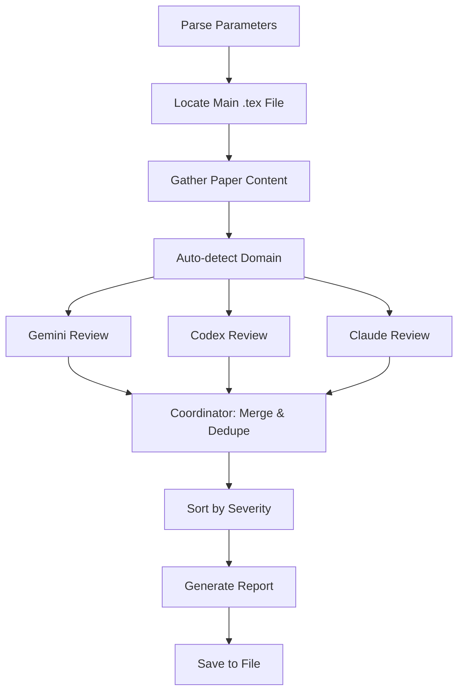

# 📄 Paper Review

> Multi-agent LaTeX paper review using Gemini, Codex, and Claude in parallel for comprehensive analysis

**Multi-Agent System** · **Parallel Execution** · **Domain Expertise** · **Unified Report** · **Auto-Merge**

  

[English](README.md) | [简体中文](README_CN.md)

---

## ✨ Features

- **Parallel Multi-Agent Review** — Deploy Gemini, Codex, and Claude simultaneously for diverse perspectives
- **Domain-Aware Analysis** — Auto-detect paper domain (ML, theory, etc.) and load specialized review criteria
- **Four Review Dimensions** — Writing quality, technical logic, paper structure, and LaTeX formatting
- **Smart Coordination** — Merge findings from multiple reviewers, deduplicate similar issues, preserve unique insights
- **Severity Ranking** — Prioritize critical flaws (logic errors, missing experiments) over polish suggestions
- **Mandatory Report Export** — Always saves timestamped markdown report to paper directory

## 🔄 How It Works



Three reviewers analyze the paper in parallel using different CLI tools. A coordinator then merges their findings, deduplicates similar issues, and produces a unified report sorted by severity.

## 🚀 Quick Start

### Prerequisites

Install at least one reviewer CLI:

```bash
# Gemini CLI (recommended)
npm install -g @google/generative-ai-cli

# Codex CLI
npm install -g @anthropic-ai/codex-cli

# Claude Code (already available in OpenClaw)
```

### Usage

```bash
# Multi-agent mode (all reviewers in parallel)
/paper-review path/to/paper.tex

# Single reviewer mode
/paper-review paper.tex --reviewer=gemini

# Focus on specific areas
/paper-review paper.tex --focus=writing,logic

# Review entire directory (auto-detects main .tex)
/paper-review ./paper-dir/
```

### Parameters

- `<file-or-dir>` (optional): Path to `.tex` file or directory. Auto-detects if omitted.
- `--reviewer=<gemini|codex|claude|all>`: Select reviewer(s). Default: `all` (multi-agent mode).
- `--focus=<writing|logic|structure|formatting|all>`: Narrow review scope. Default: `all`.

## 📖 Review Dimensions

### Writing Quality
- Grammar and spelling errors with suggested rewrites
- Awkward phrasing and passive voice overuse
- Vague claims without evidence ("significantly improves")
- Inconsistent terminology throughout paper

### Technical Logic
- Mathematical correctness (equations, proofs)
- Experimental methodology soundness
- Statistical significance validation
- Fair baseline comparisons and missing ablations

### Paper Structure
- Abstract completeness and flow
- Introduction logic (problem → gap → contribution)
- Related work coverage and positioning
- Conclusion vs. introduction consistency

### LaTeX Formatting
- Table and figure quality (captions, labels)
- Consistent notation and abbreviations
- Bibliography completeness
- Cross-reference correctness (`\ref`, `\cite`)

## ⚙️ CLI Command Differences

**⚠️ CRITICAL: Each reviewer CLI has different syntax**

| Reviewer | Command Pattern | Notes |
|----------|----------------|-------|
| Gemini | `cat paper.tex \| gemini -p "prompt"` | Accepts stdin pipe ✅ |
| Codex | `codex exec --sandbox read-only --ephemeral "prompt"` | Reads files directly ✅ |
| Claude | Task tool (subagent spawn) | Context-aware ✅ |

## 🏗️ Project Structure

```
paper-review/
├── SKILL.md                # Main workflow documentation
├── expertise/              # Domain-specific review criteria
│   ├── _index.md           # Domain detection rules
│   └── ml.md               # Machine learning expertise
├── reviewers/              # Individual reviewer roles
│   ├── gemini-role.md      # Gemini review prompt
│   ├── codex-role.md       # Codex review prompt
│   ├── claude-role.md      # Claude review prompt
│   └── coordinator.md      # Merge and dedupe logic
└── templates/
    └── report.md           # Output format template
```

## 📋 Report Example

```markdown
## Paper Review Report

**Paper**: deep-learning-survey.tex
**Date**: 2026-03-08 17:45 EST
**Reviewers**: Gemini ✓, Codex ✓, Claude ✓

### Summary
- Total findings: 18 (5 High, 9 Medium, 4 Low)
- Critical issues: 2 (missing ablation, unclear baseline)

### [HIGH] #1: Missing ablation study
**Reviewers**: Gemini, Codex
**Location**: Section 4.2, page 6
**Description**: Claimed improvement over baseline but no ablation
showing which components contribute...
```

## 🗺️ Roadmap

- [ ] Support for Overleaf links (auto-download and review)
- [ ] LaTeX diff mode (review only changed sections)
- [ ] Conference-specific style checks (NeurIPS, ICML, etc.)
- [ ] Interactive fix mode (apply suggested edits)

## 🤝 Related Skills

- **techdebt** — Analyze code quality in repositories
- **notion-organizer** — Organize Notion page content
- **readme-generator** — Generate bilingual documentation

---

**Repository**: [MitchellX/awesome-skills](https://github.com/MitchellX/awesome-skills)
