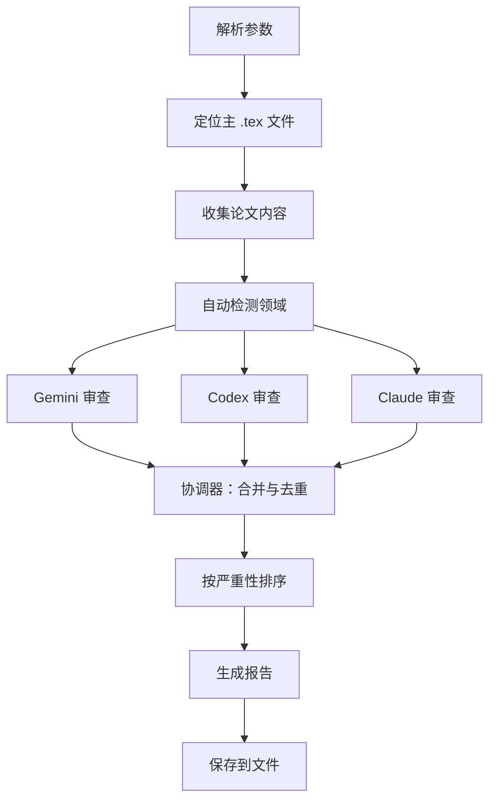

# 📄 Paper Review

> 使用 Gemini、Codex 和 Claude 并行执行的多智能体 LaTeX 论文审查工具

**多智能体系统** · **并行执行** · **领域专家** · **统一报告** · **自动合并**

  

[English](README.md) | [简体中文](README_CN.md)

---

## ✨ 功能特性

- **并行多智能体审查** — 同时部署 Gemini、Codex 和 Claude，提供多样化视角
- **领域感知分析** — 自动检测论文领域（机器学习、理论等），加载专业审查标准
- **四维度审查** — 写作质量、技术逻辑、论文结构、LaTeX 格式
- **智能协调** — 合并多个审查员的发现，去重相似问题，保留独特见解
- **严重性排序** — 优先显示关键缺陷（逻辑错误、缺失实验），而非润色建议
- **强制报告导出** — 始终保存带时间戳的 markdown 报告到论文目录

## 🔄 工作原理



三个审查员使用不同的 CLI 工具并行分析论文。协调器随后合并他们的发现，去重相似问题，生成按严重性排序的统一报告。

## 🚀 快速开始

### 前置条件

至少安装一个审查员 CLI：

```bash
# Gemini CLI（推荐）
npm install -g @google/generative-ai-cli

# Codex CLI
npm install -g @anthropic-ai/codex-cli

# Claude Code（OpenClaw 中已内置）
```

### 使用方法

```bash
# 多智能体模式（所有审查员并行）
/paper-review path/to/paper.tex

# 单审查员模式
/paper-review paper.tex --reviewer=gemini

# 聚焦特定领域
/paper-review paper.tex --focus=writing,logic

# 审查整个目录（自动检测主 .tex 文件）
/paper-review ./paper-dir/
```

### 参数

- `<file-or-dir>`（可选）：`.tex` 文件或目录路径。省略时自动检测。
- `--reviewer=<gemini|codex|claude|all>`：选择审查员。默认：`all`（多智能体模式）。
- `--focus=<writing|logic|structure|formatting|all>`：缩小审查范围。默认：`all`。

## 📖 审查维度

### 写作质量
- 语法和拼写错误，附带建议改写
- 别扭的措辞和被动语态滥用
- 缺乏证据的模糊声明（"显著提升"）
- 全文术语不一致

### 技术逻辑
- 数学正确性（方程、证明）
- 实验方法的合理性
- 统计显著性验证
- 公平的基线比较和缺失的消融实验

### 论文结构
- 摘要完整性和流畅度
- 引言逻辑（问题 → 空白 → 贡献）
- 相关工作覆盖范围和定位
- 结论与引言的一致性

### LaTeX 格式
- 表格和图形质量（标题、标签）
- 符号和缩写的一致性
- 参考文献的完整性
- 交叉引用的正确性（`\ref`、`\cite`）

## ⚙️ CLI 命令差异

**⚠️ 重要：每个审查员 CLI 的语法不同**

| 审查员 | 命令模式 | 备注 |
|--------|---------|------|
| Gemini | `cat paper.tex \| gemini -p "prompt"` | 接受 stdin 管道 ✅ |
| Codex | `codex exec --sandbox read-only --ephemeral "prompt"` | 直接读取文件 ✅ |
| Claude | Task 工具（子智能体生成） | 上下文感知 ✅ |

## 🏗️ 项目结构

```
paper-review/
├── SKILL.md                # 主工作流文档
├── expertise/              # 领域特定审查标准
│   ├── _index.md           # 领域检测规则
│   └── ml.md               # 机器学习专业知识
├── reviewers/              # 各审查员角色
│   ├── gemini-role.md      # Gemini 审查提示
│   ├── codex-role.md       # Codex 审查提示
│   ├── claude-role.md      # Claude 审查提示
│   └── coordinator.md      # 合并与去重逻辑
└── templates/
    └── report.md           # 输出格式模板
```

## 📋 报告示例

```markdown
## 论文审查报告

**论文**：deep-learning-survey.tex
**日期**：2026-03-08 17:45 EST
**审查员**：Gemini ✓、Codex ✓、Claude ✓

### 摘要
- 总发现数：18（5 个高优先级，9 个中等，4 个低优先级）
- 关键问题：2 个（缺失消融实验，基线不清晰）

### [HIGH] #1：缺失消融实验
**审查员**：Gemini、Codex
**位置**：第 4.2 节，第 6 页
**描述**：声称相对基线有改进，但没有消融实验
显示哪些组件有贡献...
```

## 🗺️ 路线图

- [ ] 支持 Overleaf 链接（自动下载并审查）
- [ ] LaTeX diff 模式（仅审查修改的章节）
- [ ] 会议特定样式检查（NeurIPS、ICML 等）
- [ ] 交互式修复模式（应用建议的编辑）

## 🤝 相关技能

- **techdebt** — 分析代码库质量
- **notion-organizer** — 组织 Notion 页面内容
- **readme-generator** — 生成双语文档

---

**仓库**：[MitchellX/awesome-skills](https://github.com/MitchellX/awesome-skills)
