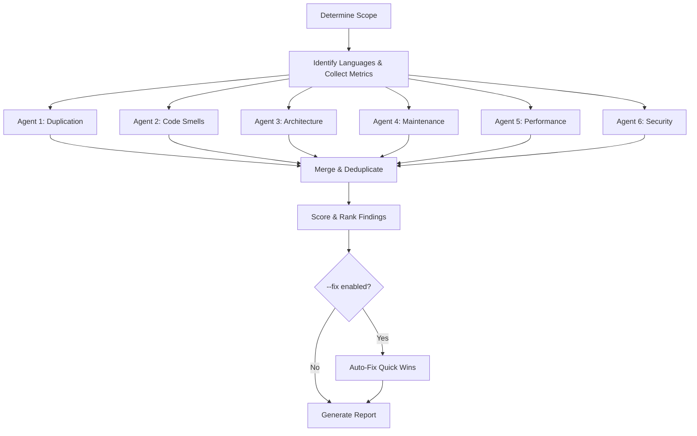

# 🔍 TechDebt

> Scan codebase for technical debt using 6 parallel subagents — covering duplication, code smells, architecture, maintenance, performance, and security — then produce actionable reports with priority-scored findings and optional auto-fix

**6 Parallel Analyzers** · **Priority Scoring** · **Auto-Fix Mode** · **Before/After Metrics** · **Health Score**

   

[English](README.md) | [简体中文](README_CN.md)

---

## ✨ Features

- **6 Parallel Agents** — Deploy specialized subagents simultaneously for fast, comprehensive scanning
- **Duplication Detection** — Find identical and near-duplicate code blocks, magic numbers, reimplemented utilities, and wheel reinvention
- **Code Smell Scanner** — Identify long functions, deep nesting, god modules, naming inconsistencies, and type safety gaps
- **Architecture Issues** — Detect circular imports, tight coupling with metrics (Ca/Ce/Instability), layer violations, and missing abstractions
- **Maintenance Risks** — Flag stale TODOs, deprecated patterns, missing error handling, and configuration debt
- **Performance Auditor** — Catch N+1 queries, blocking I/O in async code, missing caching, wasteful allocations, and over-fetching
- **Security Scanner** — Detect hardcoded secrets, SQL injection, path traversal, insecure dependencies, and missing input validation
- **Priority Scoring** — Rank findings with `(Impact × Risk) / Effort` formula across 4 severity levels
- **Auto-Fix Mode** — Safely fix quick wins with git checkpoints, test verification, and per-fix commits (`--fix`)
- **Before/After Metrics** — Compare against a baseline report to track debt reduction over time (`--baseline`)
- **Health Score** — Get a single 0–100 score summarizing overall codebase health

## 🔄 How It Works



Six specialized agents scan the codebase in parallel, each focusing on one category of technical debt. Results are merged, deduplicated, scored with the priority formula, and formatted into an actionable report. With `--fix`, safe quick wins are automatically applied with git checkpoints.

## 🚀 Quick Start

### Prerequisites

- OpenClaw with Task tool (subagent spawning)
- Read/write access to target codebase

### Usage

```bash
# Scan entire project (current directory)
/techdebt

# Scan specific directory or file
/techdebt --scope=src/

# Focus on one category
/techdebt --category=security

# Limit number of findings
/techdebt --top=10

# Auto-fix trivial issues (creates git checkpoints)
/techdebt --fix

# Compare against previous report
/techdebt --baseline=debt-report-2025-03.json
```

### Parameters

| Parameter | Default | Description |
|-----------|---------|-------------|
| `--scope=<path>` | project root | Directory or file to analyze |
| `--category` | `all` | Focus area: `all`, `duplication`, `smells`, `architecture`, `maintenance`, `performance`, `security` |
| `--top=<N>` | `15` | Maximum findings to report |
| `--fix` | off | Auto-fix quick wins (severity ≤ Medium, trivial effort) |
| `--baseline=<path>` | — | Path to previous report JSON for before/after comparison |

## 🛡️ Safety Guidelines

These rules govern all analysis and especially `--fix` mode:

- ❌ **NEVER** refactor without existing tests (or writing them first)
- ❌ **NEVER** make multiple unrelated changes in one commit
- ❌ **NEVER** refactor and add features simultaneously
- ✅ **ALWAYS** create a git checkpoint before any fix
- ✅ **ALWAYS** run tests after each change
- ✅ **ALWAYS** preserve external behavior (no functional changes)
- ✅ **ALWAYS** verify the fix compiles/passes lint before committing

**Escalation — stop and report if:** tests fail unexpectedly, fix scope grows beyond the finding, a change would alter public API, or you're unsure whether a fix is safe.

## 📖 Analysis Categories

### 1. Duplication Scanner

Detects:
- Identical function signatures across files
- Repeated code blocks (3+ lines)
- Copy-pasted logic with minor variable changes
- Repeated magic numbers/strings that should be constants
- Reimplemented stdlib utilities
- **Wheel reinvention** — custom implementations replaceable by battle-tested packages

**Example Finding:**
```
[HIGH] Duplicated validation logic (Score: 6.7)
- Locations: auth.py:45, user.py:78, admin.py:102
- Similarity: 95% (same 12-line block)
- Suggestion: Extract to shared validators.py
```

### 2. Code Smell Detector

Detects:
- Long functions (>50 lines)
- Too many parameters (>5)
- Deep nesting (3+ levels)
- Dead code (unused imports, commented blocks)
- Naming inconsistency (mixed camelCase/snake_case)
- God functions (doing multiple unrelated things)
- **Type safety gaps** — missing type hints (Python), `any` abuse (TypeScript), unchecked errors (Go)

**Example Finding:**
```
[MEDIUM] Long function: process_order() (Score: 3.3)
- Location: orders.py:120-185 (65 lines)
- Issues: Multiple responsibilities (validation, payment, notification)
- Suggestion: Split into validate_order(), process_payment(), send_confirmation()
```

### 3. Architecture Analyzer

Detects:
- Circular imports
- God modules (>15 top-level definitions or >500 lines)
- Missing abstractions (repeated patterns in 3+ files)
- Tight coupling with **coupling metrics**:
  - **Ca** (Afferent Coupling): how many modules depend on this one
  - **Ce** (Efferent Coupling): how many modules this one depends on
  - **I** (Instability): Ce / (Ca + Ce) — closer to 1.0 = more unstable
- Layer violations (e.g., views directly querying database)

**Example Finding:**
```
[HIGH] Circular dependency (Score: 8.0)
- Chain: models.py → utils.py → validators.py → models.py
- Impact: Import order matters, breaks modularity
- Suggestion: Move shared types to types.py, break cycle
```

### 4. Maintenance Risk Finder

Detects:
- Stale TODOs/FIXMEs/HACKs
- Deprecated API usage
- Missing error handling (bare except, unchecked returns)
- Configuration debt (hardcoded paths/URLs)
- Documentation debt (public APIs without docstrings)

**Example Finding:**
```
[HIGH] Missing error handling in payment flow (Score: 6.7)
- Location: payment.py:45-60
- Risk: API call has no try/except, will crash on network error
- Suggestion: Wrap in try/except, add retry logic, log failures
```

### 5. Performance Auditor

Detects:
- **N+1 queries** — database calls inside loops
- **Unnecessary full scans** — linear search where indexing/hashing is possible
- **Blocking I/O in async code** — synchronous calls in async functions
- **Missing caching** — repeated expensive computations with same inputs
- **Wasteful allocations** — object creation in tight loops, string concatenation in loops
- **Over-fetching** — `SELECT *` when only a few columns are needed

**Example Finding:**
```
[HIGH] N+1 query in order listing (Score: 8.0)
- Location: views.py:34-38
- Impact: Severe — O(n) DB queries per page load
- Suggestion: Use select_related() / prefetch_related() for batch loading
```

### 6. Security Scanner

Detects:
- **Hardcoded secrets** — API keys, passwords, tokens in source code
- **SQL injection** — string concatenation in SQL queries
- **Path traversal** — user input in file paths without sanitization
- **Insecure dependencies** — known vulnerable package patterns
- **Missing input validation** — user input in system commands, eval(), exec()
- **Exposed debug info** — debug mode in production configs

**Example Finding:**
```
[CRITICAL] Hardcoded API key (Score: 25.0)
- Location: config.py:12
- Severity: Critical — credentials exposed in source control
- Suggestion: Move to environment variable, add to .gitignore, rotate key immediately
```

## 📊 Priority Scoring

Each finding is scored using a transparent formula:

```
Priority Score = (Impact × Risk) / Effort
```

| Dimension | Scale | Anchors |
|-----------|-------|---------|
| **Impact** | 1–5 | 1 = cosmetic, 3 = maintainability, 5 = security/data loss |
| **Risk** | 1–5 | 1 = theoretical, 3 = moderate probability, 5 = already causing issues |
| **Effort** | 1–5 | 1 = trivial (<5 min), 3 = medium (1-2 hrs), 5 = multi-day refactor |

**Severity thresholds:**

| Severity | Score | Examples |
|----------|-------|----------|
| **Critical** | ≥ 10 | Security vulns, data loss risks, production bugs |
| **High** | 5 – 9.9 | Bugs waiting to happen, circular deps, duplicated business logic |
| **Medium** | 2 – 4.9 | Code smells, missing abstractions, stale TODOs |
| **Low** | < 2 | Style issues, naming, cosmetic dead code |

## 📋 Report Format

```markdown
## 🔧 Technical Debt Report

**Scope**: src/
**Scanned**: 127 files, 14,230 lines of code
**Findings**: 18 (2 Critical, 5 High, 8 Medium, 3 Low)
**Health Score**: 72/100

### 📊 Summary

| Category       | Critical | High | Medium | Low | Total |
|----------------|----------|------|--------|-----|-------|
| Duplication    | 0        | 2    | 3      | 1   | 6     |
| Code Smells    | 0        | 1    | 2      | 2   | 5     |
| Architecture   | 0        | 2    | 1      | 0   | 3     |
| Maintenance    | 0        | 0    | 1      | 0   | 1     |
| Performance    | 1        | 0    | 1      | 0   | 2     |
| Security       | 1        | 0    | 0      | 0   | 1     |
| **Total**      | 2        | 5    | 8      | 3   | 18    |

### ⚡ Quick Wins (Top 5)

1. Remove unused imports — 15 occurrences (trivial, score: 3.0)
2. Extract duplicated validation — save 40 lines (small, score: 4.5)
...

### 📈 Before/After Metrics (if --baseline provided)

| Metric          | Before | After  | Change |
|-----------------|--------|--------|--------|
| Total Findings  | 24     | 18     | -6     |
| Critical Issues | 3      | 2      | -1     |
| Health Score    | 58/100 | 72/100 | +14    |
```

## 🔨 Auto-Fix Mode

When run with `--fix`, the skill automatically repairs trivial issues:

1. **Checkpoint** — Creates a git stash or commit before any changes
2. **Filter** — Only fixes findings with effort ≤ 2 (trivial/small), severity ≤ Medium, and marked auto-fixable
3. **Apply** — Makes changes one at a time, runs tests after each
4. **Commit** — Each successful fix gets its own commit (`fix(techdebt): ...`)
5. **Report** — Shows what was fixed and what needs manual attention

```
### 🔨 Auto-Fix Results

| # | Finding                    | Status             | Commit  |
|---|----------------------------|--------------------|---------| 
| 1 | Remove unused import X     | ✅ Fixed           | abc1234 |
| 2 | Extract magic number Y     | ✅ Fixed           | def5678 |
| 3 | Remove dead code block     | ❌ Tests failed    | —       |
```

## 🏗️ Project Structure

```
techdebt/
└── SKILL.md          # Complete workflow and agent instructions
```

## 🗺️ Roadmap

- [x] ~~Auto-fix mode for trivial issues~~ ✅ Shipped
- [x] ~~Trend tracking (compare reports over time)~~ ✅ `--baseline` flag
- [x] ~~Performance analysis~~ ✅ Agent 5: Performance Auditor
- [x] ~~Security scanning~~ ✅ Agent 6: Security Scanner
- [ ] Language-specific analyzers (Python, TypeScript, Go, Rust)
- [ ] Integration with linters (pylint, ESLint, clippy)
- [ ] CI/CD integration (run on PRs, block merge on Critical findings)

## 🤝 Related Skills

- **paper-review** — Multi-agent LaTeX paper review
- **notion-organizer** — Organize Notion page content
- **readme-generator** — Generate bilingual documentation

---

**Repository**: [MitchellX/awesome-skills](https://github.com/MitchellX/awesome-skills)
