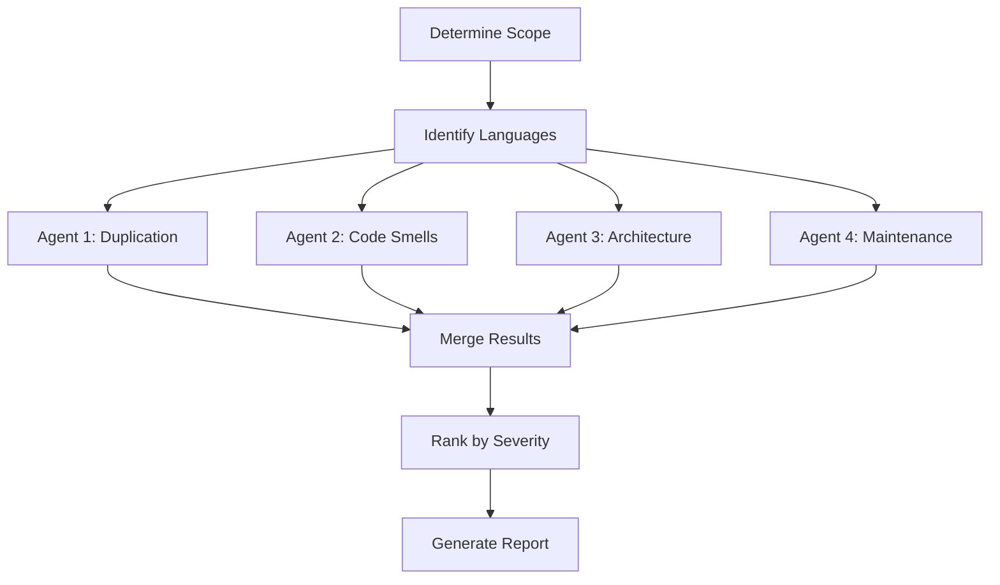

# 🔍 TechDebt

> Scan codebase for technical debt using parallel subagents and produce actionable reports with prioritized findings

**4 Parallel Analyzers** · **Duplication Detection** · **Code Smell Scanner** · **Architecture Review** · **Maintenance Risk**

  

[English](README.md) | [简体中文](README_CN.md)

---

## ✨ Features

- **Parallel Analysis** — Deploy 4 specialized subagents simultaneously for fast, comprehensive scanning
- **Duplication Detection** — Find identical and near-duplicate code blocks, magic numbers, and reimplemented utilities
- **Code Smell Scanner** — Identify long functions, deep nesting, god modules, and naming inconsistencies
- **Architecture Issues** — Detect circular imports, tight coupling, layer violations, and missing abstractions
- **Maintenance Risks** — Flag stale TODOs, deprecated patterns, missing error handling, and configuration debt
- **Severity Ranking** — Prioritize high-impact issues (bugs waiting to happen) over cosmetic problems

## 🔄 How It Works



Four specialized agents scan the codebase in parallel, each focusing on one category of technical debt. Results are merged, deduplicated, ranked by severity, and formatted into an actionable report.

## 🚀 Quick Start

### Prerequisites

- OpenClaw with Task tool (subagent spawning)
- Read/write access to target codebase

### Usage

```bash
# Scan entire project (current directory)
/techdebt

# Scan specific directory or file
/techdebt --scope=src/

# Focus on one category
/techdebt --category=duplication

# Limit number of findings
/techdebt --top=10
```

### Parameters

- `--scope=<path>` (optional): Directory or file to analyze. Default: project root.
- `--category=<all|duplication|smells|architecture|maintenance>` (optional): Focus area. Default: `all`.
- `--top=<N>` (optional): Maximum findings to report. Default: `15`.

## 📖 Analysis Categories

### 1. Duplication Scanner

Detects:
- Identical function signatures across files
- Repeated code blocks (3+ lines)
- Copy-pasted logic with minor variable changes
- Repeated magic numbers/strings that should be constants
- Reimplemented stdlib utilities

**Example Finding:**
```
[HIGH] Duplicated validation logic
- Locations: auth.py:45, user.py:78, admin.py:102
- Similarity: 95% (same 12-line block)
- Suggestion: Extract to shared validators.py
```

### 2. Code Smell Detector

Detects:
- Long functions (>50 lines)
- Too many parameters (>5)
- Deep nesting (3+ levels)
- Dead code (unused imports, commented blocks)
- Naming inconsistency (mixed camelCase/snake_case)
- God functions (doing multiple unrelated things)

**Example Finding:**
```
[MEDIUM] Long function: process_order()
- Location: orders.py:120-185 (65 lines)
- Issues: Multiple responsibilities (validation, payment, notification)
- Suggestion: Split into validate_order(), process_payment(), send_confirmation()
```

### 3. Architecture Analyzer

Detects:
- Circular imports
- God modules (>15 top-level definitions or >500 lines)
- Missing abstractions (repeated patterns in 3+ files)
- Tight coupling (too many internal imports)
- Layer violations (e.g., views directly querying database)

**Example Finding:**
```
[HIGH] Circular dependency
- Chain: models.py → utils.py → validators.py → models.py
- Impact: Import order matters, breaks modularity
- Suggestion: Move shared types to types.py, break cycle
```

### 4. Maintenance Risk Finder

Detects:
- Stale TODOs/FIXMEs/HACKs
- Deprecated API usage
- Missing error handling (bare except, unchecked returns)
- Type safety gaps (missing type hints)
- Configuration debt (hardcoded paths/URLs)

**Example Finding:**
```
[HIGH] Missing error handling in payment flow
- Location: payment.py:45-60
- Risk: API call has no try/except, will crash on network error
- Suggestion: Wrap in try/except, add retry logic, log failures
```

## ⚙️ Severity Levels

| Level | Examples |
|-------|----------|
| **HIGH** | Bugs waiting to happen, security risks, circular dependencies, duplicated business logic |
| **MEDIUM** | Code smells affecting readability, missing abstractions, impactful TODOs |
| **LOW** | Style issues, minor naming inconsistencies, cosmetic dead code |

## 🏗️ Project Structure

```
techdebt/
└── SKILL.md          # Complete workflow and agent instructions
```

## 📋 Report Format

```markdown
## Technical Debt Report

**Scope**: src/
**Files scanned**: 127
**Findings**: 15 (5 High, 7 Medium, 3 Low)

### Summary

| Category       | High | Medium | Low | Total |
|----------------|------|--------|-----|-------|
| Duplication    | 2    | 3      | 1   | 6     |
| Code Smells    | 1    | 2      | 2   | 5     |
| Architecture   | 2    | 1      | 0   | 3     |
| Maintenance    | 0    | 1      | 0   | 1     |
| **Total**      | 5    | 7      | 3   | 15    |

### Findings

#### [HIGH] #1: Circular import cycle
- **Category**: Architecture
- **Location**: `models.py` → `utils.py` → `models.py`
- **Description**: Import order dependency breaks modularity
- **Suggestion**: Move shared types to types.py

...

### Quick Wins (Top 3)

1. **Remove unused imports** — 15 occurrences (trivial)
2. **Extract duplicated validation** — Save 40 lines (small)
3. **Add type hints to public API** — 8 functions (small)
```

## 🗺️ Roadmap

- [ ] Language-specific analyzers (Python, TypeScript, Go, Rust)
- [ ] Integration with linters (pylint, ESLint, clippy)
- [ ] Trend tracking (compare reports over time)
- [ ] Auto-fix mode for trivial issues (unused imports, formatting)

## 🤝 Related Skills

- **paper-review** — Multi-agent LaTeX paper review
- **notion-organizer** — Organize Notion page content
- **readme-generator** — Generate bilingual documentation

---

**Repository**: [MitchellX/awesome-skills](https://github.com/MitchellX/awesome-skills)
