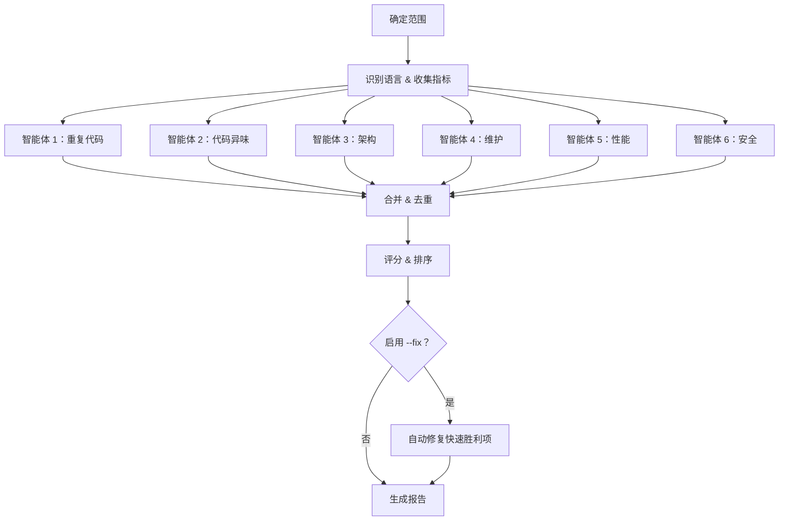

# 🔍 TechDebt

> 使用 6 个并行子智能体扫描代码库技术债务——覆盖重复代码、代码异味、架构、维护、性能和安全——生成带优先级评分的可操作报告，支持自动修复

**6 并行分析器** · **优先级评分** · **自动修复模式** · **前后对比指标** · **健康分数**

   

[English](README.md) | [简体中文](README_CN.md)

---

## ✨ 功能特性

- **6 并行智能体** — 同时部署专业子智能体，快速全面扫描
- **重复代码检测** — 发现相同和近似重复的代码块、魔法数字、重新实现的工具函数、轮子重造
- **代码异味扫描** — 识别长函数、深层嵌套、上帝模块、命名不一致、类型安全缺口
- **架构问题** — 检测循环导入、紧耦合（含 Ca/Ce/不稳定性指标）、层级违规、缺失的抽象
- **维护风险** — 标记过时的 TODO、废弃模式、缺失的错误处理、配置债务
- **性能审计** — 捕获 N+1 查询、异步代码中的阻塞 I/O、缺失缓存、浪费的内存分配、过度获取
- **安全扫描** — 检测硬编码密钥、SQL 注入、路径遍历、不安全依赖、缺失的输入验证
- **优先级评分** — 使用 `(影响 × 风险) / 成本` 公式对发现进行排序，分 4 个严重级别
- **自动修复模式** — 安全修复快速胜利项，含 git 检查点、测试验证、逐项提交（`--fix`）
- **前后对比指标** — 对比基线报告，跟踪债务减少趋势（`--baseline`）
- **健康分数** — 获取 0–100 分的代码库整体健康评分

## 🔄 工作原理



六个专业智能体并行扫描代码库，每个专注于一类技术债务。结果被合并、去重、用优先级公式评分，格式化为可操作的报告。使用 `--fix` 时，安全的快速胜利项会被自动修复并创建 git 检查点。

## 🚀 快速开始

### 前置条件

- 带 Task 工具（子智能体生成）的 OpenClaw
- 对目标代码库的读写访问权限

### 使用方法

```bash
# 扫描整个项目（当前目录）
/techdebt

# 扫描特定目录或文件
/techdebt --scope=src/

# 专注于一个类别
/techdebt --category=security

# 限制发现数量
/techdebt --top=10

# 自动修复简单问题（创建 git 检查点）
/techdebt --fix

# 与之前的报告对比
/techdebt --baseline=debt-report-2025-03.json
```

### 参数

| 参数 | 默认值 | 说明 |
|------|--------|------|
| `--scope=<path>` | 项目根目录 | 要分析的目录或文件 |
| `--category` | `all` | 关注领域：`all`、`duplication`、`smells`、`architecture`、`maintenance`、`performance`、`security` |
| `--top=<N>` | `15` | 报告的最大发现数 |
| `--fix` | 关闭 | 自动修复快速胜利项（严重性 ≤ 中等，成本极低） |
| `--baseline=<path>` | — | 之前报告的 JSON 路径，用于前后对比 |

## 🛡️ 安全准则

以下规则适用于所有分析，尤其是 `--fix` 模式：

- ❌ **永远不要**在没有测试的情况下重构（或先写测试）
- ❌ **永远不要**在一个提交中做多个不相关的更改
- ❌ **永远不要**同时重构和添加功能
- ✅ **始终**在修复前创建 git 检查点
- ✅ **始终**在每次更改后运行测试
- ✅ **始终**保持外部行为不变（不做功能性更改）
- ✅ **始终**确认修复能编译/通过 lint 后再提交

**升级处理——遇到以下情况立即停止并报告：**测试意外失败、修复范围超出单个发现、更改会影响公共 API、不确定修复是否安全。

## 📖 分析类别

### 1. 重复代码扫描器

检测：
- 跨文件的相同函数签名
- 重复的代码块（3 行以上）
- 带微小变量变化的复制粘贴逻辑
- 应该是常量的重复魔法数字/字符串
- 重新实现的标准库工具
- **轮子重造** — 可以用成熟开源包替代的自定义实现

**示例发现：**
```
[HIGH] 重复的验证逻辑 (Score: 6.7)
- 位置：auth.py:45、user.py:78、admin.py:102
- 相似度：95%（相同的 12 行块）
- 建议：提取到共享的 validators.py
```

### 2. 代码异味检测器

检测：
- 长函数（>50 行）
- 过多参数（>5 个）
- 深层嵌套（3 层以上）
- 死代码（未使用的导入、注释块）
- 命名不一致（混合 camelCase/snake_case）
- 上帝函数（做多个不相关的事情）
- **类型安全缺口** — 缺少类型提示（Python）、滥用 `any`（TypeScript）、未检查的错误（Go）

**示例发现：**
```
[MEDIUM] 长函数：process_order() (Score: 3.3)
- 位置：orders.py:120-185（65 行）
- 问题：多重职责（验证、支付、通知）
- 建议：拆分为 validate_order()、process_payment()、send_confirmation()
```

### 3. 架构分析器

检测：
- 循环导入
- 上帝模块（>15 个顶级定义或 >500 行）
- 缺失的抽象（3 个以上文件中的重复模式）
- 紧耦合，带**耦合度指标**：
  - **Ca**（传入耦合）：有多少模块依赖该模块
  - **Ce**（传出耦合）：该模块依赖多少其他模块
  - **I**（不稳定性）：Ce / (Ca + Ce) — 越接近 1.0 越不稳定
- 层级违规（例如，视图直接查询数据库）

**示例发现：**
```
[HIGH] 循环依赖 (Score: 8.0)
- 链：models.py → utils.py → validators.py → models.py
- 影响：导入顺序敏感，破坏模块化
- 建议：将共享类型移至 types.py，打破循环
```

### 4. 维护风险发现器

检测：
- 过时的 TODO/FIXME/HACK
- 废弃的 API 使用
- 缺失的错误处理（裸 except、未检查的返回）
- 配置债务（硬编码路径/URL）
- 文档债务（无文档的公共 API）

**示例发现：**
```
[HIGH] 支付流程中缺失错误处理 (Score: 6.7)
- 位置：payment.py:45-60
- 风险：API 调用无 try/except，网络错误时会崩溃
- 建议：包装在 try/except 中，添加重试逻辑，记录失败
```

### 5. 性能审计器

检测：
- **N+1 查询** — 循环内的数据库调用
- **不必要的全扫描** — 可以用索引/哈希的场景却用线性搜索
- **异步代码中的阻塞 I/O** — 异步函数中的同步文件/网络调用
- **缺失缓存** — 相同输入的重复昂贵计算（无 memoization/缓存）
- **浪费的内存分配** — 紧密循环中创建对象/列表、循环中的字符串拼接
- **过度获取** — 只需要几列却查询所有列（`SELECT *`）

**示例发现：**
```
[HIGH] 订单列表中的 N+1 查询 (Score: 8.0)
- 位置：views.py:34-38
- 影响：严重 — 每次页面加载 O(n) 次数据库查询
- 建议：使用 select_related() / prefetch_related() 批量加载
```

### 6. 安全扫描器

检测：
- **硬编码密钥** — 源代码中的 API 密钥、密码、令牌
- **SQL 注入** — SQL 查询中的字符串拼接
- **路径遍历** — 未经过滤的用户输入直接用于文件路径
- **不安全依赖** — 已知漏洞的包使用模式
- **缺失的输入验证** — 用户输入传入系统命令、eval()、exec()
- **暴露的调试信息** — 生产配置中启用调试模式

**示例发现：**
```
[CRITICAL] 硬编码 API 密钥 (Score: 25.0)
- 位置：config.py:12
- 严重性：关键 — 凭据暴露在源代码管理中
- 建议：迁移到环境变量，加入 .gitignore，立即轮换密钥
```

## 📊 优先级评分

每个发现使用透明公式评分：

```
优先级分数 = (影响 × 风险) / 成本
```

| 维度 | 范围 | 锚点 |
|------|------|------|
| **影响** | 1–5 | 1 = 表面问题, 3 = 可维护性, 5 = 安全/数据丢失 |
| **风险** | 1–5 | 1 = 理论上的, 3 = 中等概率, 5 = 已在引发问题 |
| **成本** | 1–5 | 1 = 极简单 (<5 分钟), 3 = 中等 (1-2 小时), 5 = 多天重构 |

**严重性阈值：**

| 严重性 | 分数 | 示例 |
|--------|------|------|
| **Critical** | ≥ 10 | 安全漏洞、数据丢失风险、生产 bug |
| **High** | 5 – 9.9 | 潜在 bug、循环依赖、重复的业务逻辑 |
| **Medium** | 2 – 4.9 | 代码异味、缺失的抽象、过时的 TODO |
| **Low** | < 2 | 样式问题、命名、表面死代码 |

## 📋 报告格式

```markdown
## 🔧 技术债务报告

**范围**：src/
**扫描**：127 文件，14,230 行代码
**发现**：18（2 Critical，5 High，8 Medium，3 Low）
**健康分数**：72/100

### 📊 摘要

| 类别        | Critical | High | Medium | Low | 总计 |
|-------------|----------|------|--------|-----|------|
| 重复代码     | 0        | 2    | 3      | 1   | 6    |
| 代码异味     | 0        | 1    | 2      | 2   | 5    |
| 架构         | 0        | 2    | 1      | 0   | 3    |
| 维护         | 0        | 0    | 1      | 0   | 1    |
| 性能         | 1        | 0    | 1      | 0   | 2    |
| 安全         | 1        | 0    | 0      | 0   | 1    |
| **总计**     | 2        | 5    | 8      | 3   | 18   |

### ⚡ 快速修复（前 5 项）

1. 删除未使用的导入 — 15 处（极简单，score: 3.0）
2. 提取重复的验证 — 节省 40 行（小，score: 4.5）
...

### 📈 前后对比指标（使用 --baseline 时）

| 指标         | 之前    | 之后    | 变化   |
|-------------|---------|---------|--------|
| 总发现数     | 24      | 18      | -6     |
| Critical 问题 | 3      | 2       | -1     |
| 健康分数     | 58/100  | 72/100  | +14    |
```

## 🔨 自动修复模式

使用 `--fix` 运行时，自动修复简单问题：

1. **检查点** — 修改前创建 git stash 或 commit
2. **筛选** — 仅修复成本 ≤ 2（极简单/小）、严重性 ≤ Medium、标记为可自动修复的发现
3. **应用** — 逐项更改，每次更改后运行测试
4. **提交** — 每个成功的修复单独提交（`fix(techdebt): ...`）
5. **报告** — 展示修复结果和需要人工处理的项目

```
### 🔨 自动修复结果

| # | 发现                    | 状态             | 提交    |
|---|------------------------|------------------|---------| 
| 1 | 删除未使用的导入 X      | ✅ 已修复         | abc1234 |
| 2 | 提取魔法数字 Y          | ✅ 已修复         | def5678 |
| 3 | 删除死代码块            | ❌ 测试失败        | —       |
```

## 🏗️ 项目结构

```
techdebt/
└── SKILL.md          # 完整的工作流和智能体指令
```

## 🗺️ 路线图

- [x] ~~自动修复模式~~ ✅ 已上线
- [x] ~~趋势跟踪（随时间比较报告）~~ ✅ `--baseline` 参数
- [x] ~~性能分析~~ ✅ 智能体 5：性能审计器
- [x] ~~安全扫描~~ ✅ 智能体 6：安全扫描器
- [ ] 特定语言分析器（Python、TypeScript、Go、Rust）
- [ ] 与 linter 集成（pylint、ESLint、clippy）
- [ ] CI/CD 集成（在 PR 上运行，Critical 发现阻止合并）

## 🤝 相关技能

- **paper-review** — 多智能体 LaTeX 论文审查
- **notion-organizer** — 组织 Notion 页面内容
- **readme-generator** — 生成双语文档

---

**仓库**：[MitchellX/awesome-skills](https://github.com/MitchellX/awesome-skills)
