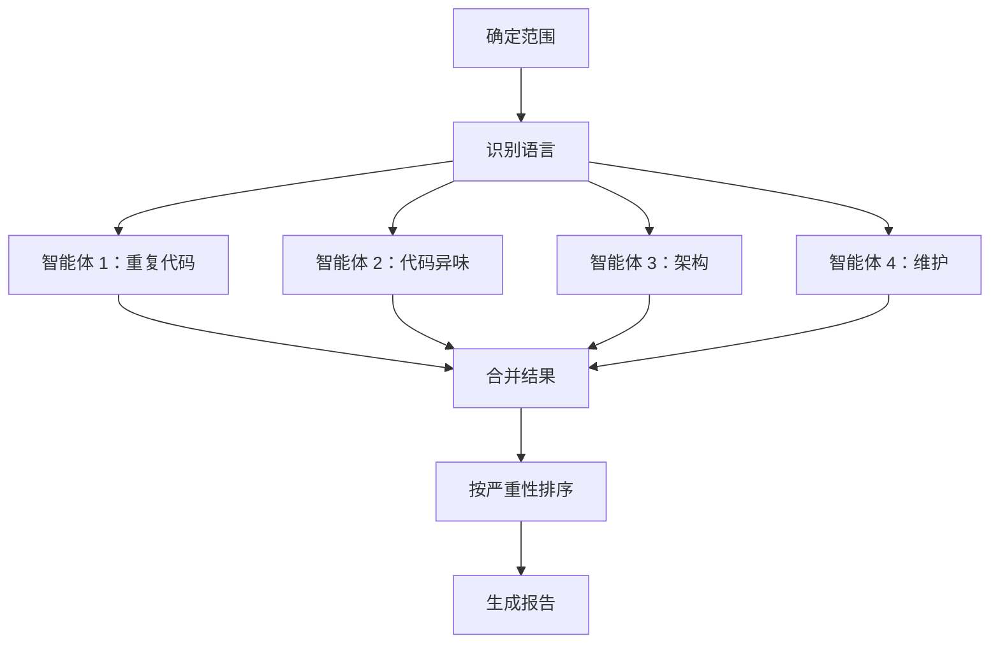

# 🔍 TechDebt

> 使用并行子智能体扫描代码库技术债务，生成带优先级的可操作报告

**4 并行分析器** · **重复代码检测** · **代码异味扫描** · **架构审查** · **维护风险**

  

[English](README.md) | [简体中文](README_CN.md)

---

## ✨ 功能特性

- **并行分析** — 同时部署 4 个专业子智能体，快速全面扫描
- **重复代码检测** — 发现相同和近似重复的代码块、魔法数字、重新实现的工具函数
- **代码异味扫描** — 识别长函数、深层嵌套、上帝模块、命名不一致
- **架构问题** — 检测循环导入、紧耦合、层级违规、缺失的抽象
- **维护风险** — 标记过时的 TODO、废弃模式、缺失的错误处理、配置债务
- **严重性排序** — 优先处理高影响问题（潜在 bug），而非表面问题

## 🔄 工作原理



四个专业智能体并行扫描代码库，每个专注于一类技术债务。结果被合并、去重、按严重性排序，格式化为可操作的报告。

## 🚀 快速开始

### 前置条件

- 带 Task 工具（子智能体生成）的 OpenClaw
- 对目标代码库的读写访问权限

### 使用方法

```bash
# 扫描整个项目（当前目录）
/techdebt

# 扫描特定目录或文件
/techdebt --scope=src/

# 专注于一个类别
/techdebt --category=duplication

# 限制发现数量
/techdebt --top=10
```

### 参数

- `--scope=<path>`（可选）：要分析的目录或文件。默认：项目根目录。
- `--category=<all|duplication|smells|architecture|maintenance>`（可选）：关注领域。默认：`all`。
- `--top=<N>`（可选）：报告的最大发现数。默认：`15`。

## 📖 分析类别

### 1. 重复代码扫描器

检测：
- 跨文件的相同函数签名
- 重复的代码块（3 行以上）
- 带微小变量变化的复制粘贴逻辑
- 应该是常量的重复魔法数字/字符串
- 重新实现的标准库工具

**示例发现：**
```
[HIGH] 重复的验证逻辑
- 位置：auth.py:45、user.py:78、admin.py:102
- 相似度：95%（相同的 12 行块）
- 建议：提取到共享的 validators.py
```

### 2. 代码异味检测器

检测：
- 长函数（>50 行）
- 过多参数（>5 个）
- 深层嵌套（3 层以上）
- 死代码（未使用的导入、注释块）
- 命名不一致（混合 camelCase/snake_case）
- 上帝函数（做多个不相关的事情）

**示例发现：**
```
[MEDIUM] 长函数：process_order()
- 位置：orders.py:120-185（65 行）
- 问题：多重职责（验证、支付、通知）
- 建议：拆分为 validate_order()、process_payment()、send_confirmation()
```

### 3. 架构分析器

检测：
- 循环导入
- 上帝模块（>15 个顶级定义或 >500 行）
- 缺失的抽象（3 个以上文件中的重复模式）
- 紧耦合（过多的内部导入）
- 层级违规（例如，视图直接查询数据库）

**示例发现：**
```
[HIGH] 循环依赖
- 链：models.py → utils.py → validators.py → models.py
- 影响：导入顺序敏感，破坏模块化
- 建议：将共享类型移至 types.py，打破循环
```

### 4. 维护风险发现器

检测：
- 过时的 TODO/FIXME/HACK
- 废弃的 API 使用
- 缺失的错误处理（裸 except、未检查的返回）
- 类型安全缺口（缺少类型提示）
- 配置债务（硬编码路径/URL）

**示例发现：**
```
[HIGH] 支付流程中缺失错误处理
- 位置：payment.py:45-60
- 风险：API 调用无 try/except，网络错误时会崩溃
- 建议：包装在 try/except 中，添加重试逻辑，记录失败
```

## ⚙️ 严重性级别

| 级别 | 示例 |
|------|------|
| **HIGH** | 潜在 bug、安全风险、循环依赖、重复的业务逻辑 |
| **MEDIUM** | 影响可读性的代码异味、缺失的抽象、有影响的 TODO |
| **LOW** | 样式问题、轻微的命名不一致、表面死代码 |

## 🏗️ 项目结构

```
techdebt/
└── SKILL.md          # 完整的工作流和智能体指令
```

## 📋 报告格式

```markdown
## 技术债务报告

**范围**：src/
**扫描文件数**：127
**发现数**：15（5 个高优先级，7 个中等，3 个低优先级）

### 摘要

| 类别        | 高 | 中等 | 低 | 总计 |
|-------------|----|----|----|----|
| 重复代码     | 2  | 3  | 1  | 6  |
| 代码异味     | 1  | 2  | 2  | 5  |
| 架构         | 2  | 1  | 0  | 3  |
| 维护         | 0  | 1  | 0  | 1  |
| **总计**     | 5  | 7  | 3  | 15 |

### 发现

#### [HIGH] #1：循环导入
- **类别**：架构
- **位置**：`models.py` → `utils.py` → `models.py`
- **描述**：导入顺序依赖破坏模块化
- **建议**：将共享类型移至 types.py

...

### 快速修复（前 3 项）

1. **删除未使用的导入** — 15 处（简单）
2. **提取重复的验证** — 节省 40 行（小）
3. **为公共 API 添加类型提示** — 8 个函数（小）
```

## 🗺️ 路线图

- [ ] 特定语言分析器（Python、TypeScript、Go、Rust）
- [ ] 与 linter 集成（pylint、ESLint、clippy）
- [ ] 趋势跟踪（随时间比较报告）
- [ ] 自动修复模式（处理简单问题：未使用的导入、格式）

## 🤝 相关技能

- **paper-review** — 多智能体 LaTeX 论文审查
- **notion-organizer** — 组织 Notion 页面内容
- **readme-generator** — 生成双语文档

---

**仓库**：[MitchellX/awesome-skills](https://github.com/MitchellX/awesome-skills)
